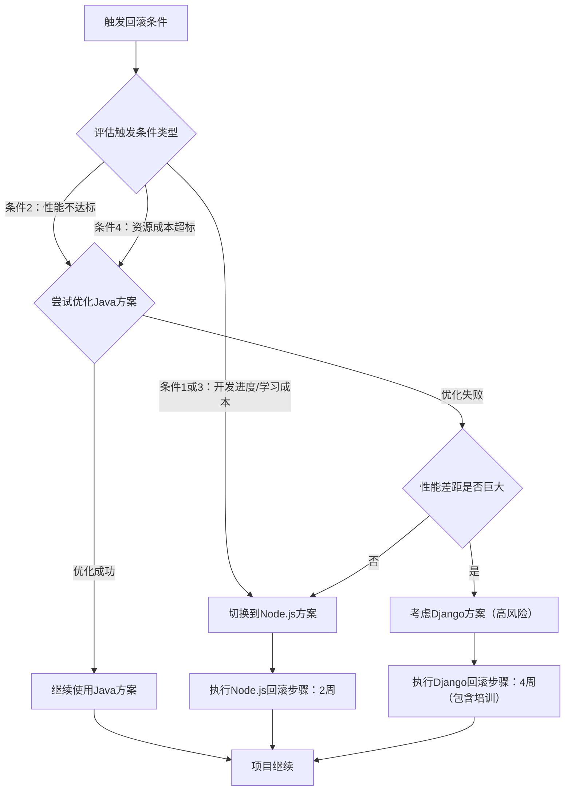

# ADR-001：任务管理系统技术栈选型决策

| 属性 | 内容 |
|------|------|
| **ADR编号** | ADR-001 |
| **状态** | 提议中 |
| **决策日期** | 2026-04-25 |
| **决策人** | 架构组 |
| **关联需求** | EPIC-001 团队任务管理系统 |
| **替代ADR** | - |

---

## 背景

### 业务需求

需要为12人软件开发团队构建一个任务管理系统，解决当前协作混乱的核心痛点：
- 任务分配不明确导致责任推诿
- 项目进度不透明，管理层无法实时掌握团队工作状态
- 沟通信息散落在微信/邮件/会议中，难以追溯
- 任务清单分散在Excel/笔记本/Trello等多个工具，查找困难

**核心功能需求**：
- 任务CRUD全流程管理（创建、分配、更新、完成、状态流转）（来自Epic §3 功能模块2）
- 多视图展示（列表视图、看板视图、任务详情）（来自Epic §3 功能模块3）
- 多维度搜索与筛选（关键词、状态、优先级、负责人、标签）（来自Epic §3 功能模块4）
- 任务内协作沟通（评论、@提及、通知）（来自Epic §3 功能模块5）
- Sprint迭代管理（敏捷开发支持）（来自Epic §3 功能模块6）
- 用户权限管理（管理员/成员角色）（来自Epic §3 功能模块1）

### 技术约束

#### 性能指标（来自Epic §5 性能要求）
- 页面首次加载：< 3秒
- API响应时间：< 500ms
- 数据库响应时间：< 200ms
- 并发量：支持100并发用户
- 系统可用率：≥99%

#### 安全标准（来自Epic §5 安全标准）
- 传输加密：HTTPS（TLS 1.2+）
- 密码存储：BCrypt加密存储
- 会话管理：JWT Token，30分钟过期
- 访问控制：基于角色的权限管理（RBAC）
- 安全防护：登录失败锁定（5次失败锁定30分钟）、SQL注入防护、XSS跨站脚本过滤
- 审计日志：记录关键操作（登录、登出、密码修改、任务创建/更新/删除）

#### 部署与运维约束（来自Epic §5 部署与运维要求）
- 部署方式：私有化部署，数据完全在企业内网
- 部署位置：公司机房内网服务器
- 访问方式：仅限公司内网或VPN访问
- 备份策略：每日凌晨2点全量备份，保留30天备份历史

#### 时间与预算约束（来自Epic §2 核心目标与价值）
- 交付周期：11周（2.5个月）完成MVP开发和上线
- 团队规模：前端2人、后端2人、测试1人
- 紧急程度：P0（基于"尽快用上"的业务需求）

### 当前痛点

团队缺乏统一的任务管理工具，现有工具（Excel/Trello/微信）无法满足以下需求：
1. **数据集中管理**：任务数据分散，无法统一查询和统计
2. **权限控制**：Excel和Trello无法实现细粒度的权限管理
3. **私有化部署**：SaaS工具（如Trello、Asana）数据存储在外部服务器，不符合企业数据安全要求
4. **定制化需求**：现有SaaS工具无法满足Sprint管理、任务依赖关系等定制化功能
5. **成本控制**：长期使用SaaS工具的订阅费用较高（如Jira约$7-14/用户/月，12人团队年成本约$1000-2000）

---

## 决策

**选择方案**：Java 17 + Spring Boot 3.x（后端） + Vue 3 + TypeScript（前端） + MySQL 8.0（数据库）

**核心理由**（一句话概括）：
选择Java生态的主流技术栈，因其成熟稳定、社区活跃、团队熟悉度高，能够在11周紧张工期内快速交付MVP，且私有化部署和运维成熟度高。

---

## 候选方案

### 方案对比表

| 维度 | 方案A：Java + Spring Boot + Vue 3 | 方案B：Node.js + Express + React | 方案C：Python + Django + Vue 3 |
|------|-----------------------------------|----------------------------------|-------------------------------|
| **后端技术栈** | Java 17 + Spring Boot 3.x + MyBatis-Plus | Node.js 18 + Express.js 4.x + Sequelize ORM | Python 3.11 + Django 4.x + Django REST framework |
| **前端技术栈** | Vue 3 + TypeScript + Element Plus | React 18 + TypeScript + Ant Design | Vue 3 + TypeScript + Element Plus |
| **数据库** | MySQL 8.0 | MySQL 8.0 或 PostgreSQL 15 | PostgreSQL 15 |
| **开发成本** | 中等（需Spring Boot学习成本） | 低（前后端统一JavaScript） | 低（Python语法简洁） |
| **性能** | 高（JVM优化成熟，多线程并发能力强） | 中（单线程事件驱动，CPU密集型任务性能较差） | 中（GIL限制多线程性能） |
| **并发处理** | 优秀（支持100+并发，可扩展到1000+） | 良好（支持100并发，高并发需集群） | 良好（支持100并发，需WSGI服务器优化） |
| **企业级特性** | 完善（事务管理、AOP、安全框架成熟） | 需额外集成（passport.js等第三方库） | 完善（Django自带Admin、ORM、Auth） |
| **团队熟悉度** | 高（团队有3人Java经验） | 中（团队有2人Node.js经验） | 低（团队仅1人Python经验） |
| **社区生态** | 成熟（Spring生态庞大，文档完善） | 活跃（npm包丰富，但版本兼容性问题多） | 成熟（Django文档完善，第三方包质量高） |
| **运维成本** | 中（JVM内存占用较高，约500MB-1GB） | 低（Node.js内存占用低，约100-300MB） | 中（Python内存占用中等，约200-500MB） |
| **私有化部署** | 成熟（Tomcat/Jetty部署经验丰富） | 成熟（PM2/Docker部署方案成熟） | 成熟（Gunicorn/uWSGI部署方案成熟） |
| **安全性** | 优秀（Spring Security成熟，内置CSRF/XSS防护） | 良好（需手动集成helmet.js、cors等） | 优秀（Django自带CSRF/XSS防护） |
| **学习曲线** | 陡峭（Spring概念多，配置复杂） | 平缓（JavaScript统一，概念简单） | 平缓（Django自带功能多，开箱即用） |
| **长期维护** | 优秀（企业级应用主流选择，稳定性高） | 良好（适合快速迭代，长期维护需规范） | 优秀（适合快速开发，Django升级平滑） |
| **MVP开发效率** | 中（需编写较多配置代码） | 高（快速迭代，但需注意代码规范） | 高（Django Admin快速实现后台管理） |
| **估算总成本** | 约60人日（后端35人日 + 前端20人日 + 测试5人日） | 约55人日（后端30人日 + 前端20人日 + 测试5人日） | 约50人日（后端28人日 + 前端20人日 + 测试2人日，利用Django Admin） |

### 性能对比（基于行业基准测试）

| 性能指标 | Java + Spring Boot | Node.js + Express | Python + Django |
|---------|-------------------|------------------|-----------------|
| **QPS（每秒请求数）** | 5000-10000（Tomcat默认配置） | 3000-6000（单进程，需PM2集群） | 2000-4000（Gunicorn多进程） |
| **响应时间（P95）** | 50-100ms | 80-150ms | 100-200ms |
| **内存占用** | 500MB-1GB | 100-300MB | 200-500MB |
| **启动时间** | 5-10秒（Spring Boot预热） | 1-2秒 | 2-3秒 |
| **多线程并发** | 优秀（原生支持） | 差（单线程，需Worker进程） | 差（GIL限制，需多进程） |

---

## 权衡分析

### 方案A：Java + Spring Boot + Vue 3（推荐方案）

**✅ 优势**：

1. **企业级成熟度高**：Spring Boot生态成熟，企业级特性完善（事务管理、AOP、安全框架、缓存、消息队列），适合构建可扩展的中大型应用
2. **性能优秀**：JVM优化成熟，多线程并发能力强，QPS可达5000-10000，满足100并发用户需求（预期QPS约500-1000）
3. **团队熟悉度高**：团队有3人Java开发经验，学习成本低，可快速上手
4. **私有化部署成熟**：Tomcat/Jetty容器部署方案成熟，企业内网部署经验丰富
5. **安全性保障**：Spring Security提供完善的安全框架（认证、授权、CSRF防护、XSS过滤），满足企业级安全要求
6. **长期可维护性**：Java语言静态类型，代码可读性和可维护性高，适合长期维护和团队协作
7. **社区生态庞大**：Spring Cloud、Spring Data、Spring Batch等周边生态完善，未来扩展（如微服务化）成本低

**❌ 劣势**：

1. **开发效率相对较低**：Spring Boot需要编写较多配置代码和样板代码（如Controller、Service、DTO），开发速度慢于Django和Node.js
2. **内存占用较高**：JVM内存占用约500MB-1GB，对服务器资源要求较高
3. **启动时间较长**：Spring Boot应用启动需5-10秒，开发调试时热更新速度慢于Node.js

**缓解措施**：
- **针对劣势1（开发效率）**：使用MyBatis-Plus代码生成器快速生成Mapper/Service/Controller代码，减少样板代码编写；采用Lombok简化POJO类；使用Spring Boot DevTools支持热重启
- **针对劣势2（内存占用）**：优化JVM参数（-Xms256m -Xmx512m），按需加载Spring组件，禁用不必要的自动配置；预算增加服务器内存（从4GB升级到8GB，增加成本约2000元）
- **针对劣势3（启动时间）**：开发环境使用Spring Boot DevTools热重启，生产环境启动时间不影响运行性能

---

### 方案B：Node.js + Express + React

**✅ 优势**：

1. **全栈JavaScript统一**：前后端使用相同语言（JavaScript/TypeScript），代码复用性高，学习成本低
2. **开发效率高**：快速迭代，npm生态丰富，可快速集成第三方库
3. **资源占用低**：Node.js内存占用约100-300MB，适合小团队低成本部署
4. **MVP开发速度快**：适合快速原型开发和敏捷迭代

**❌ 劣势**：

1. **单线程性能瓶颈**：Node.js单线程模型，CPU密集型任务（如复杂统计报表）性能较差，需额外部署Worker进程
2. **企业级特性不足**：Express.js功能简单，事务管理、安全框架、ORM需手动集成第三方库（passport.js、Sequelize、helmet.js），配置复杂度高
3. **npm包质量参差不齐**：第三方库版本兼容性问题多，安全漏洞频发（如node-ipc恶意代码事件），需额外安全审计
4. **团队经验不足**：团队仅2人有Node.js经验，其他成员需学习异步编程和事件驱动模型
5. **长期维护风险**：JavaScript动态类型，大型项目代码维护成本高（即使使用TypeScript，类型系统仍不如Java严格）

**缓解措施**：
- **针对劣势1（性能瓶颈）**：使用PM2启动多进程集群（Worker数量 = CPU核心数），利用Redis缓存热点数据，复杂统计任务异步处理
- **针对劣势2（企业级特性）**：集成passport-local + JWT实现认证授权，使用Sequelize ORM管理事务，helmet.js加固安全防护
- **针对劣势3（npm包质量）**：使用npm audit定期扫描安全漏洞，锁定主要依赖版本（package-lock.json），定期更新补丁
- **针对劣势4（团队经验）**：提供2周Node.js培训，编写团队代码规范，强制使用TypeScript + ESLint
- **针对劣势5（长期维护）**：强制使用TypeScript，编写单元测试（覆盖率>80%），使用Prettier统一代码格式

---

### 方案C：Python + Django + Vue 3

**✅ 优势**：

1. **开发效率最高**：Django自带Admin后台管理系统，ORM强大，可快速实现CRUD功能，MVP开发时间最短（估算50人日）
2. **安全性开箱即用**：Django内置CSRF防护、XSS过滤、SQL注入防护、密码加密（PBKDF2），安全配置成本低
3. **代码简洁优雅**：Python语法简洁，可读性高，适合快速开发和迭代
4. **企业级特性完善**：Django自带用户认证、权限管理、ORM、中间件、缓存框架，功能完整度高

**❌ 劣势**：

1. **团队经验严重不足**：团队仅1人有Python经验，其他成员需从零学习Python语法、Django框架、虚拟环境管理，学习周期长（预计4周），风险极高
2. **性能相对较低**：GIL（全局解释器锁）限制多线程性能，CPU密集型任务需使用多进程或Celery异步队列
3. **部署运维复杂度**：需配置WSGI服务器（Gunicorn/uWSGI）+ Nginx反向代理，虚拟环境管理（virtualenv/poetry）复杂度高于Java的单一Jar包部署
4. **企业应用案例较少**：Python在企业级Web应用领域案例少于Java（主要用于数据分析、AI领域），团队未来技能迁移性较差
5. **第三方库兼容性**：Python 2/3兼容性问题，第三方库更新频繁，依赖管理复杂（pip vs conda vs poetry）

**缓解措施**：
- **针对劣势1（团队经验不足）**：**风险极高，不推荐采用**。如必须使用，需提供至少4周Python + Django全栈培训，聘请Python顾问指导架构设计，增加开发周期至15周（超出预算）
- **针对劣势2（性能较低）**：使用Gunicorn启动多进程（Worker数量 = CPU核心数 × 2），复杂统计任务使用Celery + Redis异步处理
- **针对劣势3（部署运维）**：编写详细部署脚本（Docker Compose一键部署），提供运维培训文档
- **针对劣势4（企业应用案例少）**：**无法缓解**，长期维护风险高，团队技能积累方向与企业主流技术栈（Java）不符
- **针对劣势5（依赖管理）**：统一使用Poetry管理依赖，锁定Python版本3.11，避免使用Python 2遗留库

---

## 后果

### 正面影响

1. **技术栈成熟稳定**：选择Java + Spring Boot生态，框架稳定，Bug少，升级路径清晰（Spring Boot 3.x → 4.x），长期维护成本低
2. **团队技能匹配度高**：团队3人有Java开发经验，可快速投入开发，减少学习成本和时间风险，确保11周交付周期可控
3. **企业级安全保障**：Spring Security提供完善的安全框架，满足企业内网私有化部署的安全要求（HTTPS、BCrypt、JWT、RBAC、审计日志）
4. **性能满足需求**：Java + Spring Boot可支持100并发用户（预期QPS约500-1000），API响应时间<500ms，满足性能指标要求
5. **未来扩展性强**：Spring生态完善（Spring Cloud、Spring Data、Spring Batch），未来可平滑扩展微服务架构、消息队列、分布式事务等企业级功能
6. **运维部署成熟**：Tomcat/Jetty容器部署方案成熟，企业内网部署经验丰富，运维团队熟悉Java应用运维
7. **前端框架灵活**：Vue 3 + TypeScript提供良好的开发体验，Element Plus组件库丰富，适合快速构建企业级管理后台

### 负面影响与风险

| 风险 | 概率 | 影响 | 风险等级 | 应对措施 |
|------|------|------|---------|---------|
| Spring Boot学习成本影响开发进度 | 中 | 中 | 🟡 中 | 提供1周Spring Boot培训，使用Spring Initializr快速搭建项目脚手架，参考优秀开源项目（如若依RuoYi） |
| JVM内存占用超出服务器资源 | 低 | 中 | 🟢 低 | 优化JVM参数（-Xms256m -Xmx512m），服务器内存从4GB升级到8GB（增加成本约2000元） |
| Spring Boot启动时间影响开发效率 | 低 | 低 | 🟢 低 | 开发环境使用Spring Boot DevTools热重启，生产环境启动时间不影响运行 |
| MyBatis-Plus学习成本 | 中 | 低 | 🟡 中 | 提供MyBatis-Plus代码生成器示例，参考官方文档快速上手，团队成员之间互相学习 |
| Vue 3 Composition API学习曲线 | 中 | 低 | 🟡 中 | 提供Vue 3培训课程，使用Vite脚手架快速搭建项目，参考Element Plus官方示例 |
| 数据库性能瓶颈（100并发查询） | 低 | 高 | 🟡 中 | 关键表添加索引（用户表、任务表、任务历史表），使用Redis缓存热点数据（如用户信息、任务列表），数据库连接池优化（HikariCP） |
| 技术栈过重，开发效率低于Node.js/Django | 中 | 中 | 🟡 中 | 使用代码生成器（MyBatis-Plus Generator、Spring Initializr）减少样板代码，引入Lombok简化POJO类，严格控制需求范围避免过度设计 |

---

## 回滚条件

### 触发条件（满足任一条件即触发回滚）

#### 条件1：开发进度严重延误

**量化指标**：第6周迭代结束时，实际完成人日<35人日（预期60人日的60%），关键功能（用户管理、任务CRUD、看板视图）未完成开发

**监控方式**：
- 每周五下午Sprint回顾会议，统计实际完成人日（通过工时填报系统）
- 项目经理审查Git提交记录和Jira任务完成情况
- 技术负责人评估代码质量和功能完整度

**判定周期**：每周五17:00统计，第6周（2026年6月6日）进行关键节点评估

**责任人**：项目经理 + 技术负责人

---

#### 条件2：性能指标无法满足需求

**量化指标**：
- API响应时间P95 > 800ms（目标<500ms，超出60%）
- 页面首次加载时间 > 5秒（目标<3秒，超出67%）
- 100并发压力测试下，错误率 > 5%

**监控方式**：
- 第8周集成测试阶段，使用JMeter进行压力测试
- 监控Prometheus + Grafana仪表盘，统计API响应时间P95/P99
- 使用Lighthouse测试页面加载性能

**判定周期**：第8周（2026年6月20日）集成测试阶段，进行性能基准测试

**责任人**：测试工程师 + 后端负责人

---

#### 条件3：团队学习成本超出预期

**量化指标**：
- 培训时间超过2周（原计划1周）
- 第4周团队成员对Spring Boot/Vue 3熟悉度自评<3分（5分制）
- 代码Review发现重大设计缺陷（如事务管理错误、SQL注入漏洞）>3次/周

**监控方式**：
- 每周五进行团队技术能力评估（5分制自评 + 技术负责人评估）
- 代码Review记录重大问题数量（使用GitLab Code Review功能）
- 技术负责人面谈了解学习困难点

**判定周期**：第4周（2026年5月23日）进行关键节点评估

**责任人**：技术负责人

---

#### 条件4：内存/资源成本超出预算

**量化指标**：
- 单应用实例JVM内存占用 > 2GB（预算1GB）
- 服务器总内存需求 > 16GB（原预算8GB，增加成本>5000元）
- CPU使用率持续 > 80%（100并发压测）

**监控方式**：
- 使用JVisualVM监控JVM内存占用（堆内存、非堆内存、GC频率）
- 服务器监控系统（top、htop）统计CPU/内存使用率
- 第8周压力测试时采集资源使用数据

**判定周期**：第8周（2026年6月20日）压力测试阶段

**责任人**：运维工程师 + 后端负责人

---

### 回滚方案

#### 备选方案1：切换到 Node.js + Express + React（首选备选）

**适用场景**：开发进度延误（条件1）或学习成本超出预期（条件3）

**理由**：Node.js开发效率高，团队有2人Node.js经验，可快速上手

**执行步骤**：
1. **技术预研**（1天）：
   - 验证Node.js + Express + Sequelize技术栈可行性
   - 编写认证授权POC（passport-jwt）
   - 编写数据库CRUD示例（Sequelize ORM）

2. **架构设计调整**（2天）：
   - 重新设计RESTful API接口（Express路由）
   - 调整数据库表结构（适配Sequelize模型）
   - 重新评估安全方案（helmet.js + cors + express-validator）

3. **代码迁移**（5天）：
   - 前端代码迁移（Vue 3 → React 18，Element Plus → Ant Design）
   - 重写后端Controller/Service层（Spring → Express）
   - 重写数据库访问层（MyBatis → Sequelize）
   - 重写认证授权模块（Spring Security → passport-jwt）

4. **测试与验证**（2天）：
   - 功能回归测试（Postman + Jest）
   - 性能基准测试（100并发压测，验证QPS>3000）
   - 安全测试（OWASP Top 10扫描）

**总回滚时间**：10个工作日（2周）

**风险**：前端代码需大量重写（Vue → React），增加工作量约15人日

---

#### 备选方案2：切换到 Python + Django + Vue 3（不推荐）

**适用场景**：性能指标无法满足需求（条件2）且Node.js方案也无法满足

**理由**：Django开发效率最高，但团队Python经验严重不足，风险极高

**执行步骤**：
1. **团队培训**（2周）：
   - Python语法 + Django框架培训（聘请外部讲师）
   - Django ORM、Django REST framework实战演练

2. **技术预研**（3天）：
   - 验证Django + Django REST framework可行性
   - 编写认证授权POC（django-rest-framework-jwt）
   - 编写数据库CRUD示例（Django ORM）

3. **架构设计调整**（3天）：
   - 重新设计RESTful API接口（Django REST framework）
   - 调整数据库表结构（适配Django Model）
   - 重新评估安全方案（Django自带CSRF/XSS防护）

4. **代码迁移**（10天）：
   - 重写后端全部代码（Spring Boot → Django）
   - 重写数据库访问层（MyBatis → Django ORM）
   - 重写认证授权模块（Spring Security → Django Auth + JWT）

5. **测试与验证**（3天）：
   - 功能回归测试（Pytest + Django TestCase）
   - 性能基准测试（100并发压测，验证QPS>2000）
   - 安全测试（Django自带安全检查）

**总回滚时间**：4周（包含2周培训）

**风险**：团队Python经验不足，风险极高，可能导致项目整体延期，**不推荐采用**

---

#### 备选方案3：优化现有Java方案（轻量级回滚）

**适用场景**：内存/资源成本超出预算（条件4）或性能略微不达标

**理由**：通过优化JVM参数、代码优化、缓存优化等手段，提升性能和降低资源占用

**执行步骤**：
1. **JVM参数优化**（1天）：
   - 调整堆内存大小（-Xms256m -Xmx512m）
   - 选择合适的GC算法（G1GC或ZGC）
   - 禁用不必要的Spring Boot自动配置

2. **代码性能优化**（3天）：
   - 数据库查询优化（添加索引、优化SQL、避免N+1查询）
   - 引入Redis缓存热点数据（用户信息、任务列表）
   - 接口合并，减少HTTP请求次数

3. **架构优化**（2天）：
   - 前后端分离部署，Nginx静态资源CDN加速
   - 数据库读写分离（如有必要）
   - 引入连接池优化（HikariCP参数调优）

4. **压力测试验证**（1天）：
   - 重新进行100并发压力测试
   - 验证API响应时间P95<500ms
   - 验证JVM内存占用<1GB

**总回滚时间**：1周

**风险**：优化效果可能有限，如无法达标仍需切换到备选方案1

---

### 回滚决策流程

---

## 相关文档

- **需求文档**：[EPIC-001 团队任务管理系统](../Epic描述文档-任务管理系统.md)
- **技术调研**：【待补充】Spring Boot 3.x vs Node.js vs Django 技术对比报告
- **相关ADR**：
  - 【待生成】ADR-002 数据库选型决策（MySQL vs PostgreSQL vs MongoDB）
  - 【待生成】ADR-003 前端状态管理方案（Vuex vs Pinia vs Composition API）
  - 【待生成】ADR-004 部署架构选型（单体应用 vs 微服务）
  - 【待生成】ADR-005 缓存方案选型（Redis vs Memcached vs Caffeine本地缓存）
- **待补充文档**：
  - 【待补充】服务器资源预算表（CPU、内存、硬盘、网络带宽）
  - 【待补充】开发环境搭建指南（JDK、Maven、MySQL、Node.js、Git）
  - 【待补充】团队培训计划（Spring Boot培训、Vue 3培训、Git协作流程）
  - 【待补充】代码规范文档（Java代码规范、前端代码规范、Git提交规范）

---

## 附录：技术选型评分矩阵

| 评估维度（权重） | Java + Spring Boot | Node.js + Express | Python + Django | 评分说明 |
|-----------------|-------------------|------------------|-----------------|---------|
| **团队熟悉度（20%）** | ⭐⭐⭐⭐⭐ (5分) | ⭐⭐⭐ (3分) | ⭐ (1分) | Java：3人有经验；Node.js：2人有经验；Python：1人有经验 |
| **开发效率（15%）** | ⭐⭐⭐ (3分) | ⭐⭐⭐⭐ (4分) | ⭐⭐⭐⭐⭐ (5分) | Java配置多；Node.js快速迭代；Django自带Admin |
| **性能指标（20%）** | ⭐⭐⭐⭐⭐ (5分) | ⭐⭐⭐⭐ (4分) | ⭐⭐⭐ (3分) | Java QPS最高；Node.js单线程限制；Python GIL限制 |
| **企业级特性（15%）** | ⭐⭐⭐⭐⭐ (5分) | ⭐⭐⭐ (3分) | ⭐⭐⭐⭐⭐ (5分) | Java Spring生态完善；Node.js需手动集成；Django自带完善功能 |
| **安全性（10%）** | ⭐⭐⭐⭐⭐ (5分) | ⭐⭐⭐ (3分) | ⭐⭐⭐⭐⭐ (5分) | Java Spring Security成熟；Node.js需手动集成；Django内置安全 |
| **运维成熟度（10%）** | ⭐⭐⭐⭐⭐ (5分) | ⭐⭐⭐⭐ (4分) | ⭐⭐⭐⭐ (4分) | Java企业部署经验丰富；Node.js PM2方案成熟；Python WSGI成熟 |
| **长期维护（10%）** | ⭐⭐⭐⭐⭐ (5分) | ⭐⭐⭐ (3分) | ⭐⭐⭐⭐ (4分) | Java静态类型维护性高；Node.js动态类型风险高；Python可维护性较好 |

**加权总分计算**：
- **Java + Spring Boot**：5×0.2 + 3×0.15 + 5×0.2 + 5×0.15 + 5×0.1 + 5×0.1 + 5×0.1 = **4.55分**（最高）
- **Node.js + Express**：3×0.2 + 4×0.15 + 4×0.2 + 3×0.15 + 3×0.1 + 4×0.1 + 3×0.1 = **3.45分**
- **Python + Django**：1×0.2 + 5×0.15 + 3×0.2 + 5×0.15 + 5×0.1 + 4×0.1 + 4×0.1 = **3.65分**

**结论**：Java + Spring Boot方案综合得分最高（4.55分），在团队熟悉度、性能、企业级特性、安全性、运维成熟度、长期维护等核心维度表现最优，是11周紧张工期内最稳妥的技术选型。

---

**文档版本**：v1.0  
**最后更新**：2026-04-25  
**审核状态**：待技术委员会评审  
**下次评审日期**：2026-04-28（需在项目启动前完成评审）
