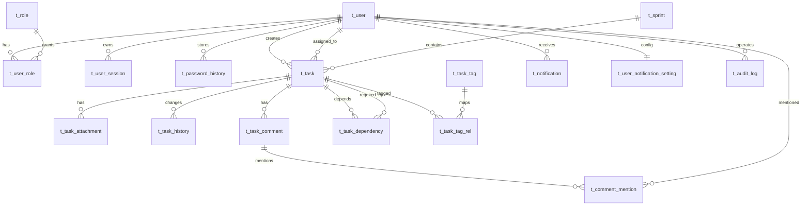

# 任务管理系统数据库设计方案（HLD-03）

> 文档编号: HLD-03  
> 文档版本: v1.0  
> 生成日期: 2026-04-28  
> 输入来源: 用户故事列表-任务管理系统-v2.0-INVEST优化版.md、HLD-01-模块划分设计文档.md、设计元素分析-用户与权限管理及任务管理核心.md、HLD-03-数据库设计提示词.md

---

## 第1章：数据库设计概览

### 1.1 技术选型与冲突消解

- 目标数据库: MySQL 8.0.x（InnoDB, utf8mb4）
- 设计依据: HLD-01与ADR-001均明确后端落地为MySQL 8.0
- 冲突处理: 设计元素分析文档中出现PostgreSQL 15约束，本方案以HLD-01/ADR-001为主基线，统一采用MySQL 8.0

### 1.2 逻辑模块与表归属

- MOD-BE-001 认证与权限: t_user, t_role, t_user_role, t_user_session
- MOD-BE-002 用户管理: t_password_history
- MOD-BE-003 任务核心: t_task, t_task_attachment, t_task_dependency, t_task_history, t_task_tag, t_task_tag_rel
- MOD-BE-005 搜索筛选: t_filter_preference
- MOD-BE-006 协作通知: t_task_comment, t_comment_mention, t_notification, t_user_notification_setting
- MOD-BE-007 Sprint管理: t_sprint
- MOD-TECH-001 公共基础: t_audit_log

### 1.3 数据量预估（3年）

估算假设:
- 日活用户 200，峰值并发 50
- 任务新增 80/天
- 单任务平均历史变更 10次、评论 4条
- 通知 3000/天，审计日志 5000/天

| 表名 | 当前预估 | 1年预估 | 3年预估 | 备注 |
|---|---:|---:|---:|---|
| t_user | 200 | 500 | 1000 | 小表 |
| t_task | 20,000 | 29,200 | 87,600 | 主业务表 |
| t_task_history | 120,000 | 292,000 | 876,000 | 高频写 |
| t_task_comment | 80,000 | 116,800 | 350,400 | 协作表 |
| t_notification | 1,000,000 | 1,095,000 | 3,285,000 | 高频写，可归档 |
| t_audit_log | 1,800,000 | 1,825,000 | 5,475,000 | 超500万，需分区/归档 |

### 1.4 表数量统计

- 核心业务表: 16张
- 字典与关联表: 4张
- 总计: 20张

---

## 第2章：ER实体关系图



---

## 第3章：数据表设计

说明:
- 通用字段约定: created_at, updated_at, is_deleted, deleted_at, deleted_by
- 时间字段统一使用 DATETIME(3)
- 主键统一 BIGINT UNSIGNED，自增
- 所有表默认字符集 utf8mb4，排序规则 utf8mb4_0900_ai_ci

### 3.1 权限与认证域

#### 3.1.1 t_user（用户主表）

| 字段 | 类型 | 主键 | 非空 | 默认值 | 说明 | 索引 |
|---|---|---|---|---|---|---|
| id | BIGINT UNSIGNED | Y | Y | AUTO_INCREMENT | 用户ID | PK |
| username | VARCHAR(64) | N | Y | - | 登录名 | UK_username |
| email | VARCHAR(128) | N | Y | - | 邮箱 | UK_email |
| password_hash | VARCHAR(255) | N | Y | - | BCrypt哈希 | - |
| display_name | VARCHAR(64) | N | Y | - | 显示名 | IDX_display_name |
| avatar_url | VARCHAR(512) | N | N | NULL | 头像URL | - |
| status | TINYINT UNSIGNED | N | Y | 1 | 1启用,2禁用,3锁定 | IDX_status |
| login_fail_count | TINYINT UNSIGNED | N | Y | 0 | 连续失败次数 | - |
| lock_expire_time | DATETIME(3) | N | N | NULL | 锁定截止时间 | IDX_lock_expire |
| last_login_at | DATETIME(3) | N | N | NULL | 最近登录时间 | - |
| created_at | DATETIME(3) | N | Y | CURRENT_TIMESTAMP(3) | 创建时间 | - |
| updated_at | DATETIME(3) | N | Y | CURRENT_TIMESTAMP(3) ON UPDATE CURRENT_TIMESTAMP(3) | 更新时间 | - |

分表策略: 不分表（3年<1万）

```sql
CREATE TABLE t_user (
  id BIGINT UNSIGNED NOT NULL AUTO_INCREMENT COMMENT '用户ID',
  username VARCHAR(64) NOT NULL COMMENT '登录名',
  email VARCHAR(128) NOT NULL COMMENT '邮箱',
  password_hash VARCHAR(255) NOT NULL COMMENT 'BCrypt密码哈希',
  display_name VARCHAR(64) NOT NULL COMMENT '显示名',
  avatar_url VARCHAR(512) NULL COMMENT '头像URL',
  status TINYINT UNSIGNED NOT NULL DEFAULT 1 COMMENT '1启用 2禁用 3锁定',
  login_fail_count TINYINT UNSIGNED NOT NULL DEFAULT 0 COMMENT '登录失败次数',
  lock_expire_time DATETIME(3) NULL COMMENT '锁定到期时间',
  last_login_at DATETIME(3) NULL COMMENT '最近登录时间',
  created_at DATETIME(3) NOT NULL DEFAULT CURRENT_TIMESTAMP(3),
  updated_at DATETIME(3) NOT NULL DEFAULT CURRENT_TIMESTAMP(3) ON UPDATE CURRENT_TIMESTAMP(3),
  PRIMARY KEY (id),
  UNIQUE KEY UK_user_username (username),
  UNIQUE KEY UK_user_email (email),
  KEY IDX_user_status (status),
  KEY IDX_user_display_name (display_name),
  KEY IDX_user_lock_expire (lock_expire_time)
) ENGINE=InnoDB DEFAULT CHARSET=utf8mb4 COLLATE=utf8mb4_0900_ai_ci COMMENT='用户主表';
```

#### 3.1.2 t_role（角色表）

| 字段 | 类型 | 主键 | 非空 | 默认值 | 说明 |
|---|---|---|---|---|---|
| id | BIGINT UNSIGNED | Y | Y | AUTO_INCREMENT | 角色ID |
| role_code | VARCHAR(32) | N | Y | - | ADMIN/MEMBER |
| role_name | VARCHAR(64) | N | Y | - | 角色名称 |
| created_at | DATETIME(3) | N | Y | CURRENT_TIMESTAMP(3) | 创建时间 |

```sql
CREATE TABLE t_role (
  id BIGINT UNSIGNED NOT NULL AUTO_INCREMENT,
  role_code VARCHAR(32) NOT NULL,
  role_name VARCHAR(64) NOT NULL,
  created_at DATETIME(3) NOT NULL DEFAULT CURRENT_TIMESTAMP(3),
  PRIMARY KEY (id),
  UNIQUE KEY UK_role_code (role_code)
) ENGINE=InnoDB DEFAULT CHARSET=utf8mb4 COLLATE=utf8mb4_0900_ai_ci COMMENT='角色表';
```

#### 3.1.3 t_user_role（用户角色关联表）

| 字段 | 类型 | 主键 | 非空 | 默认值 | 说明 | 索引 |
|---|---|---|---|---|---|---|
| id | BIGINT UNSIGNED | Y | Y | AUTO_INCREMENT | 主键 | PK |
| user_id | BIGINT UNSIGNED | N | Y | - | 用户ID | UK_user_role |
| role_id | BIGINT UNSIGNED | N | Y | - | 角色ID | IDX_role |
| created_at | DATETIME(3) | N | Y | CURRENT_TIMESTAMP(3) | 创建时间 | - |

```sql
CREATE TABLE t_user_role (
  id BIGINT UNSIGNED NOT NULL AUTO_INCREMENT,
  user_id BIGINT UNSIGNED NOT NULL,
  role_id BIGINT UNSIGNED NOT NULL,
  created_at DATETIME(3) NOT NULL DEFAULT CURRENT_TIMESTAMP(3),
  PRIMARY KEY (id),
  UNIQUE KEY UK_user_role (user_id, role_id),
  KEY IDX_user_role_role (role_id),
  CONSTRAINT FK_user_role_user FOREIGN KEY (user_id) REFERENCES t_user(id),
  CONSTRAINT FK_user_role_role FOREIGN KEY (role_id) REFERENCES t_role(id)
) ENGINE=InnoDB DEFAULT CHARSET=utf8mb4 COLLATE=utf8mb4_0900_ai_ci COMMENT='用户角色关联表';
```

#### 3.1.4 t_user_session（会话与记住我）

```sql
CREATE TABLE t_user_session (
  id BIGINT UNSIGNED NOT NULL AUTO_INCREMENT,
  user_id BIGINT UNSIGNED NOT NULL,
  session_token_hash VARCHAR(128) NOT NULL COMMENT '会话令牌哈希',
  remember_me TINYINT(1) NOT NULL DEFAULT 0,
  expires_at DATETIME(3) NOT NULL,
  revoked_at DATETIME(3) NULL,
  login_ip VARCHAR(64) NULL,
  user_agent VARCHAR(512) NULL,
  created_at DATETIME(3) NOT NULL DEFAULT CURRENT_TIMESTAMP(3),
  PRIMARY KEY (id),
  UNIQUE KEY UK_user_session_token (session_token_hash),
  KEY IDX_user_session_user_exp (user_id, expires_at),
  KEY IDX_user_session_expires (expires_at),
  CONSTRAINT FK_user_session_user FOREIGN KEY (user_id) REFERENCES t_user(id)
) ENGINE=InnoDB DEFAULT CHARSET=utf8mb4 COLLATE=utf8mb4_0900_ai_ci COMMENT='用户会话表';
```

#### 3.1.5 t_password_history（密码历史）

```sql
CREATE TABLE t_password_history (
  id BIGINT UNSIGNED NOT NULL AUTO_INCREMENT,
  user_id BIGINT UNSIGNED NOT NULL,
  password_hash VARCHAR(255) NOT NULL,
  changed_at DATETIME(3) NOT NULL DEFAULT CURRENT_TIMESTAMP(3),
  changed_by BIGINT UNSIGNED NULL,
  PRIMARY KEY (id),
  KEY IDX_pwd_hist_user_time (user_id, changed_at DESC),
  CONSTRAINT FK_pwd_hist_user FOREIGN KEY (user_id) REFERENCES t_user(id)
) ENGINE=InnoDB DEFAULT CHARSET=utf8mb4 COLLATE=utf8mb4_0900_ai_ci COMMENT='密码历史表';
```

### 3.2 任务管理域

#### 3.2.1 t_sprint（迭代表）

```sql
CREATE TABLE t_sprint (
  id BIGINT UNSIGNED NOT NULL AUTO_INCREMENT,
  sprint_name VARCHAR(64) NOT NULL,
  goal VARCHAR(500) NULL,
  start_date DATE NOT NULL,
  end_date DATE NOT NULL,
  status TINYINT UNSIGNED NOT NULL DEFAULT 1 COMMENT '1规划中 2进行中 3已关闭 4已归档',
  created_by BIGINT UNSIGNED NOT NULL,
  created_at DATETIME(3) NOT NULL DEFAULT CURRENT_TIMESTAMP(3),
  updated_at DATETIME(3) NOT NULL DEFAULT CURRENT_TIMESTAMP(3) ON UPDATE CURRENT_TIMESTAMP(3),
  PRIMARY KEY (id),
  KEY IDX_sprint_status_date (status, start_date, end_date),
  CONSTRAINT FK_sprint_creator FOREIGN KEY (created_by) REFERENCES t_user(id),
  CONSTRAINT CHK_sprint_date CHECK (start_date <= end_date)
) ENGINE=InnoDB DEFAULT CHARSET=utf8mb4 COLLATE=utf8mb4_0900_ai_ci COMMENT='Sprint迭代表';
```

#### 3.2.2 t_task（任务主表）

| 字段 | 类型 | 主键 | 非空 | 默认值 | 说明 | 索引 |
|---|---|---|---|---|---|---|
| id | BIGINT UNSIGNED | Y | Y | AUTO_INCREMENT | 任务ID | PK |
| title | VARCHAR(100) | N | Y | - | 任务标题 | IDX_title |
| description_md | MEDIUMTEXT | N | N | NULL | Markdown描述 | FULLTEXT_desc |
| status | TINYINT UNSIGNED | N | Y | 1 | 1待办2进行中3完成4关闭 | IDX_status_due |
| priority | TINYINT UNSIGNED | N | Y | 2 | 1高2中3低 | IDX_priority |
| assignee_id | BIGINT UNSIGNED | N | N | NULL | 负责人 | IDX_assignee_status |
| creator_id | BIGINT UNSIGNED | N | Y | - | 创建人 | IDX_creator |
| sprint_id | BIGINT UNSIGNED | N | N | NULL | 所属Sprint | IDX_sprint_status |
| due_date | DATE | N | N | NULL | 截止日期 | IDX_status_due |
| completed_at | DATETIME(3) | N | N | NULL | 完成时间 | - |
| is_deleted | TINYINT(1) | N | Y | 0 | 软删标记 | IDX_deleted |
| deleted_at | DATETIME(3) | N | N | NULL | 删除时间 | - |
| deleted_by | BIGINT UNSIGNED | N | N | NULL | 删除人 | - |
| created_at | DATETIME(3) | N | Y | CURRENT_TIMESTAMP(3) | 创建时间 | IDX_created |
| updated_at | DATETIME(3) | N | Y | CURRENT_TIMESTAMP(3) ON UPDATE CURRENT_TIMESTAMP(3) | 更新时间 | - |

分表策略: 暂不分表（3年<10万），当单表>500万时按创建年月分表。

```sql
CREATE TABLE t_task (
  id BIGINT UNSIGNED NOT NULL AUTO_INCREMENT,
  title VARCHAR(100) NOT NULL,
  description_md MEDIUMTEXT NULL,
  status TINYINT UNSIGNED NOT NULL DEFAULT 1 COMMENT '1待办 2进行中 3完成 4关闭',
  priority TINYINT UNSIGNED NOT NULL DEFAULT 2 COMMENT '1高 2中 3低',
  assignee_id BIGINT UNSIGNED NULL,
  creator_id BIGINT UNSIGNED NOT NULL,
  sprint_id BIGINT UNSIGNED NULL,
  due_date DATE NULL,
  completed_at DATETIME(3) NULL,
  is_deleted TINYINT(1) NOT NULL DEFAULT 0,
  deleted_at DATETIME(3) NULL,
  deleted_by BIGINT UNSIGNED NULL,
  created_at DATETIME(3) NOT NULL DEFAULT CURRENT_TIMESTAMP(3),
  updated_at DATETIME(3) NOT NULL DEFAULT CURRENT_TIMESTAMP(3) ON UPDATE CURRENT_TIMESTAMP(3),
  PRIMARY KEY (id),
  KEY IDX_task_assignee_status (assignee_id, status, due_date),
  KEY IDX_task_creator (creator_id, created_at DESC),
  KEY IDX_task_sprint_status (sprint_id, status),
  KEY IDX_task_status_due (status, due_date),
  KEY IDX_task_priority (priority),
  KEY IDX_task_deleted (is_deleted, created_at DESC),
  KEY IDX_task_created (created_at DESC),
  FULLTEXT KEY FTX_task_title_desc (title, description_md),
  CONSTRAINT FK_task_assignee FOREIGN KEY (assignee_id) REFERENCES t_user(id),
  CONSTRAINT FK_task_creator FOREIGN KEY (creator_id) REFERENCES t_user(id),
  CONSTRAINT FK_task_sprint FOREIGN KEY (sprint_id) REFERENCES t_sprint(id)
) ENGINE=InnoDB DEFAULT CHARSET=utf8mb4 COLLATE=utf8mb4_0900_ai_ci COMMENT='任务主表';
```

#### 3.2.3 t_task_attachment（任务附件）

```sql
CREATE TABLE t_task_attachment (
  id BIGINT UNSIGNED NOT NULL AUTO_INCREMENT,
  task_id BIGINT UNSIGNED NOT NULL,
  file_name VARCHAR(255) NOT NULL,
  file_url VARCHAR(1024) NOT NULL,
  file_size BIGINT UNSIGNED NOT NULL,
  file_type VARCHAR(128) NULL,
  uploaded_by BIGINT UNSIGNED NOT NULL,
  uploaded_at DATETIME(3) NOT NULL DEFAULT CURRENT_TIMESTAMP(3),
  is_deleted TINYINT(1) NOT NULL DEFAULT 0,
  PRIMARY KEY (id),
  KEY IDX_task_attachment_task (task_id, is_deleted),
  CONSTRAINT FK_task_attachment_task FOREIGN KEY (task_id) REFERENCES t_task(id),
  CONSTRAINT FK_task_attachment_uploader FOREIGN KEY (uploaded_by) REFERENCES t_user(id)
) ENGINE=InnoDB DEFAULT CHARSET=utf8mb4 COLLATE=utf8mb4_0900_ai_ci COMMENT='任务附件表';
```

#### 3.2.4 t_task_dependency（任务依赖）

```sql
CREATE TABLE t_task_dependency (
  id BIGINT UNSIGNED NOT NULL AUTO_INCREMENT,
  task_id BIGINT UNSIGNED NOT NULL COMMENT '后置任务',
  depends_on_task_id BIGINT UNSIGNED NOT NULL COMMENT '前置任务',
  created_by BIGINT UNSIGNED NOT NULL,
  created_at DATETIME(3) NOT NULL DEFAULT CURRENT_TIMESTAMP(3),
  PRIMARY KEY (id),
  UNIQUE KEY UK_task_dependency (task_id, depends_on_task_id),
  KEY IDX_depends_on_task (depends_on_task_id),
  CONSTRAINT FK_task_dep_task FOREIGN KEY (task_id) REFERENCES t_task(id),
  CONSTRAINT FK_task_dep_prev FOREIGN KEY (depends_on_task_id) REFERENCES t_task(id),
  CONSTRAINT CHK_task_not_self_dep CHECK (task_id <> depends_on_task_id)
) ENGINE=InnoDB DEFAULT CHARSET=utf8mb4 COLLATE=utf8mb4_0900_ai_ci COMMENT='任务依赖表';
```

#### 3.2.5 t_task_history（任务历史）

```sql
CREATE TABLE t_task_history (
  id BIGINT UNSIGNED NOT NULL AUTO_INCREMENT,
  task_id BIGINT UNSIGNED NOT NULL,
  operator_id BIGINT UNSIGNED NOT NULL,
  action_type TINYINT UNSIGNED NOT NULL COMMENT '1创建 2编辑 3状态变更 4负责人变更 5删除',
  action_desc VARCHAR(500) NOT NULL,
  changed_fields_json JSON NULL,
  old_values_json JSON NULL,
  new_values_json JSON NULL,
  operated_at DATETIME(3) NOT NULL DEFAULT CURRENT_TIMESTAMP(3),
  PRIMARY KEY (id),
  KEY IDX_task_history_task_time (task_id, operated_at DESC),
  KEY IDX_task_history_operator_time (operator_id, operated_at DESC),
  CONSTRAINT FK_task_history_task FOREIGN KEY (task_id) REFERENCES t_task(id),
  CONSTRAINT FK_task_history_operator FOREIGN KEY (operator_id) REFERENCES t_user(id)
) ENGINE=InnoDB DEFAULT CHARSET=utf8mb4 COLLATE=utf8mb4_0900_ai_ci COMMENT='任务操作历史';
```

#### 3.2.6 t_task_tag / t_task_tag_rel（标签）

```sql
CREATE TABLE t_task_tag (
  id BIGINT UNSIGNED NOT NULL AUTO_INCREMENT,
  tag_name VARCHAR(32) NOT NULL,
  tag_color VARCHAR(16) NULL,
  created_by BIGINT UNSIGNED NOT NULL,
  created_at DATETIME(3) NOT NULL DEFAULT CURRENT_TIMESTAMP(3),
  PRIMARY KEY (id),
  UNIQUE KEY UK_task_tag_name (tag_name),
  CONSTRAINT FK_task_tag_creator FOREIGN KEY (created_by) REFERENCES t_user(id)
) ENGINE=InnoDB DEFAULT CHARSET=utf8mb4 COLLATE=utf8mb4_0900_ai_ci COMMENT='任务标签表';

CREATE TABLE t_task_tag_rel (
  id BIGINT UNSIGNED NOT NULL AUTO_INCREMENT,
  task_id BIGINT UNSIGNED NOT NULL,
  tag_id BIGINT UNSIGNED NOT NULL,
  created_at DATETIME(3) NOT NULL DEFAULT CURRENT_TIMESTAMP(3),
  PRIMARY KEY (id),
  UNIQUE KEY UK_task_tag_rel (task_id, tag_id),
  KEY IDX_task_tag_rel_tag (tag_id),
  CONSTRAINT FK_task_tag_rel_task FOREIGN KEY (task_id) REFERENCES t_task(id),
  CONSTRAINT FK_task_tag_rel_tag FOREIGN KEY (tag_id) REFERENCES t_task_tag(id)
) ENGINE=InnoDB DEFAULT CHARSET=utf8mb4 COLLATE=utf8mb4_0900_ai_ci COMMENT='任务标签关联表';
```

### 3.3 搜索筛选域

#### 3.3.1 t_filter_preference（筛选偏好）

```sql
CREATE TABLE t_filter_preference (
  id BIGINT UNSIGNED NOT NULL AUTO_INCREMENT,
  user_id BIGINT UNSIGNED NOT NULL,
  preference_name VARCHAR(64) NOT NULL,
  filter_config_json JSON NOT NULL,
  is_default TINYINT(1) NOT NULL DEFAULT 0,
  created_at DATETIME(3) NOT NULL DEFAULT CURRENT_TIMESTAMP(3),
  updated_at DATETIME(3) NOT NULL DEFAULT CURRENT_TIMESTAMP(3) ON UPDATE CURRENT_TIMESTAMP(3),
  PRIMARY KEY (id),
  UNIQUE KEY UK_filter_pref_user_name (user_id, preference_name),
  KEY IDX_filter_pref_user_default (user_id, is_default),
  CONSTRAINT FK_filter_pref_user FOREIGN KEY (user_id) REFERENCES t_user(id)
) ENGINE=InnoDB DEFAULT CHARSET=utf8mb4 COLLATE=utf8mb4_0900_ai_ci COMMENT='筛选偏好表';
```

### 3.4 协作与通知域

#### 3.4.1 t_task_comment（任务评论）

```sql
CREATE TABLE t_task_comment (
  id BIGINT UNSIGNED NOT NULL AUTO_INCREMENT,
  task_id BIGINT UNSIGNED NOT NULL,
  author_id BIGINT UNSIGNED NOT NULL,
  content_md TEXT NOT NULL,
  is_deleted TINYINT(1) NOT NULL DEFAULT 0,
  deleted_at DATETIME(3) NULL,
  created_at DATETIME(3) NOT NULL DEFAULT CURRENT_TIMESTAMP(3),
  updated_at DATETIME(3) NOT NULL DEFAULT CURRENT_TIMESTAMP(3) ON UPDATE CURRENT_TIMESTAMP(3),
  PRIMARY KEY (id),
  KEY IDX_task_comment_task_time (task_id, created_at),
  KEY IDX_task_comment_author_time (author_id, created_at DESC),
  CONSTRAINT FK_task_comment_task FOREIGN KEY (task_id) REFERENCES t_task(id),
  CONSTRAINT FK_task_comment_author FOREIGN KEY (author_id) REFERENCES t_user(id)
) ENGINE=InnoDB DEFAULT CHARSET=utf8mb4 COLLATE=utf8mb4_0900_ai_ci COMMENT='任务评论表';
```

#### 3.4.2 t_comment_mention（评论@提及）

```sql
CREATE TABLE t_comment_mention (
  id BIGINT UNSIGNED NOT NULL AUTO_INCREMENT,
  comment_id BIGINT UNSIGNED NOT NULL,
  mentioned_user_id BIGINT UNSIGNED NOT NULL,
  created_at DATETIME(3) NOT NULL DEFAULT CURRENT_TIMESTAMP(3),
  PRIMARY KEY (id),
  UNIQUE KEY UK_comment_mention (comment_id, mentioned_user_id),
  KEY IDX_comment_mention_user (mentioned_user_id, created_at DESC),
  CONSTRAINT FK_comment_mention_comment FOREIGN KEY (comment_id) REFERENCES t_task_comment(id),
  CONSTRAINT FK_comment_mention_user FOREIGN KEY (mentioned_user_id) REFERENCES t_user(id)
) ENGINE=InnoDB DEFAULT CHARSET=utf8mb4 COLLATE=utf8mb4_0900_ai_ci COMMENT='评论提及关系';
```

#### 3.4.3 t_notification（通知表）

```sql
CREATE TABLE t_notification (
  id BIGINT UNSIGNED NOT NULL AUTO_INCREMENT,
  recipient_id BIGINT UNSIGNED NOT NULL,
  notify_type TINYINT UNSIGNED NOT NULL COMMENT '1任务分配 2状态变更 3评论回复 4提及 5截止提醒',
  title VARCHAR(200) NOT NULL,
  content VARCHAR(1000) NOT NULL,
  related_task_id BIGINT UNSIGNED NULL,
  related_comment_id BIGINT UNSIGNED NULL,
  is_read TINYINT(1) NOT NULL DEFAULT 0,
  read_at DATETIME(3) NULL,
  created_at DATETIME(3) NOT NULL DEFAULT CURRENT_TIMESTAMP(3),
  expires_at DATETIME(3) NULL COMMENT '默认30天清理',
  PRIMARY KEY (id),
  KEY IDX_notification_recipient_read_time (recipient_id, is_read, created_at DESC),
  KEY IDX_notification_task (related_task_id),
  KEY IDX_notification_expire (expires_at),
  CONSTRAINT FK_notification_user FOREIGN KEY (recipient_id) REFERENCES t_user(id),
  CONSTRAINT FK_notification_task FOREIGN KEY (related_task_id) REFERENCES t_task(id),
  CONSTRAINT FK_notification_comment FOREIGN KEY (related_comment_id) REFERENCES t_task_comment(id)
) ENGINE=InnoDB DEFAULT CHARSET=utf8mb4 COLLATE=utf8mb4_0900_ai_ci COMMENT='系统通知表';
```

#### 3.4.4 t_user_notification_setting（通知偏好）

```sql
CREATE TABLE t_user_notification_setting (
  id BIGINT UNSIGNED NOT NULL AUTO_INCREMENT,
  user_id BIGINT UNSIGNED NOT NULL,
  task_assign_enabled TINYINT(1) NOT NULL DEFAULT 1,
  task_status_enabled TINYINT(1) NOT NULL DEFAULT 1,
  mention_enabled TINYINT(1) NOT NULL DEFAULT 1,
  comment_reply_enabled TINYINT(1) NOT NULL DEFAULT 1,
  due_reminder_enabled TINYINT(1) NOT NULL DEFAULT 1,
  updated_at DATETIME(3) NOT NULL DEFAULT CURRENT_TIMESTAMP(3) ON UPDATE CURRENT_TIMESTAMP(3),
  PRIMARY KEY (id),
  UNIQUE KEY UK_notify_setting_user (user_id),
  CONSTRAINT FK_notify_setting_user FOREIGN KEY (user_id) REFERENCES t_user(id)
) ENGINE=InnoDB DEFAULT CHARSET=utf8mb4 COLLATE=utf8mb4_0900_ai_ci COMMENT='用户通知偏好';
```

### 3.5 平台审计域

#### 3.5.1 t_audit_log（审计日志）

```sql
CREATE TABLE t_audit_log (
  id BIGINT UNSIGNED NOT NULL AUTO_INCREMENT,
  operator_id BIGINT UNSIGNED NULL,
  action_type VARCHAR(64) NOT NULL,
  resource_type VARCHAR(64) NULL,
  resource_id VARCHAR(64) NULL,
  operation_result TINYINT UNSIGNED NOT NULL COMMENT '1成功 2失败 3拒绝',
  request_ip VARCHAR(64) NULL,
  user_agent VARCHAR(512) NULL,
  request_params_json JSON NULL,
  response_data_json JSON NULL,
  error_message VARCHAR(1000) NULL,
  operated_at DATETIME(3) NOT NULL DEFAULT CURRENT_TIMESTAMP(3),
  PRIMARY KEY (id),
  KEY IDX_audit_operator_time (operator_id, operated_at DESC),
  KEY IDX_audit_action_time (action_type, operated_at DESC),
  KEY IDX_audit_operated_at (operated_at),
  KEY IDX_audit_result_time (operation_result, operated_at DESC),
  CONSTRAINT FK_audit_operator FOREIGN KEY (operator_id) REFERENCES t_user(id)
) ENGINE=InnoDB DEFAULT CHARSET=utf8mb4 COLLATE=utf8mb4_0900_ai_ci COMMENT='审计日志表';
```

分表策略: 采用 RANGE 分区（按月份）或逻辑归档表，建议保留180天在线数据。

---

## 第4章：表关系映射

| 表A | 表B | 关系类型 | 外键字段 | 级联操作 |
|---|---|---|---|---|
| t_user | t_user_role | 1:N | t_user_role.user_id | RESTRICT |
| t_role | t_user_role | 1:N | t_user_role.role_id | RESTRICT |
| t_user | t_task | 1:N | t_task.creator_id / assignee_id | RESTRICT |
| t_sprint | t_task | 1:N | t_task.sprint_id | SET NULL |
| t_task | t_task_attachment | 1:N | t_task_attachment.task_id | CASCADE |
| t_task | t_task_history | 1:N | t_task_history.task_id | CASCADE |
| t_task | t_task_comment | 1:N | t_task_comment.task_id | CASCADE |
| t_task_comment | t_comment_mention | 1:N | t_comment_mention.comment_id | CASCADE |
| t_user | t_notification | 1:N | t_notification.recipient_id | CASCADE |
| t_task | t_notification | 1:N | t_notification.related_task_id | SET NULL |
| t_user | t_filter_preference | 1:N | t_filter_preference.user_id | CASCADE |
| t_user | t_audit_log | 1:N | t_audit_log.operator_id | SET NULL |
| t_task | t_task_tag_rel | 1:N | t_task_tag_rel.task_id | CASCADE |
| t_task_tag | t_task_tag_rel | 1:N | t_task_tag_rel.tag_id | RESTRICT |
| t_task | t_task_dependency | 1:N | task_id / depends_on_task_id | RESTRICT |

---

## 第5章：索引优化策略

| 表名 | 查询场景 | 索引名 | 索引字段 | 索引类型 | 预估性能提升 |
|---|---|---|---|---|---|
| t_user | 登录(用户名/邮箱) | UK_user_username / UK_user_email | username / email | 唯一索引 | >95%减少全表扫描 |
| t_user | 锁定账户检查 | IDX_user_lock_expire | lock_expire_time | 普通索引 | 登录风控查询提升10x |
| t_task | 我的任务列表 | IDX_task_assignee_status | assignee_id,status,due_date | 复合索引 | 列表查询提升8-15x |
| t_task | 看板按状态 | IDX_task_status_due | status,due_date | 复合索引 | 看板查询提升6-10x |
| t_task | Sprint看板 | IDX_task_sprint_status | sprint_id,status | 复合索引 | Sprint统计提升5-8x |
| t_task | 关键词搜索 | FTX_task_title_desc | title,description_md | 全文索引 | 模糊搜索提升5-20x |
| t_task_history | 任务历史时间线 | IDX_task_history_task_time | task_id,operated_at desc | 复合索引 | 历史页提升10x |
| t_task_comment | 评论加载 | IDX_task_comment_task_time | task_id,created_at | 复合索引 | 评论加载提升8x |
| t_notification | 通知中心 | IDX_notification_recipient_read_time | recipient_id,is_read,created_at desc | 复合索引 | 通知查询提升10x |
| t_filter_preference | 默认筛选读取 | IDX_filter_pref_user_default | user_id,is_default | 复合索引 | 偏好加载提升6x |
| t_audit_log | 时间段筛选 | IDX_audit_operated_at | operated_at | 普通索引 | 审计查询提升12x |
| t_audit_log | 用户维度审计 | IDX_audit_operator_time | operator_id,operated_at desc | 复合索引 | 审计查询提升8x |

索引治理规则:
- 写多读少表每表索引不超过6个
- 复合索引遵循最左匹配
- 每季度执行慢SQL复盘，清理低命中索引

---

## 第6章：分库分表策略

### 6.1 当前阶段（MVP）

- 架构: 单库单实例（与HLD-01一致）
- 读写策略: 单写单读，预留只读副本接入位
- 分表阈值: 单表记录数 > 500万，或单表体积 > 200GB

### 6.2 中期策略（3年内）

| 表名 | 当前数据量 | 3年预估 | 拆分策略 | 路由规则 |
|---|---:|---:|---|---|
| t_task | 2万 | 8.7万 | 不拆分 | - |
| t_task_history | 12万 | 87.6万 | 不拆分（可按月归档） | - |
| t_notification | 100万 | 328.5万 | 不分表，按月归档 | recipient_id + created_at |
| t_audit_log | 180万 | 547.5万 | 按月分区/分表 | 按 operated_at 月份路由 |

### 6.3 长期策略（>500万）

- t_audit_log_YYYYMM: 月分表，保留在线180天
- t_notification_YYYYMM: 如超过阈值启用月分表
- 分库方向: 按业务域拆库（auth/task/collab/log）
- 路由层: ShardingSphere（后续引入）

---

## 第7章：数据字典（枚举）

| 枚举类型 | 枚举值 | 说明 |
|---|---|---|
| UserStatus | 1,2,3 | 1启用 2禁用 3锁定 |
| RoleCode | ADMIN,MEMBER | 管理员/成员 |
| TaskStatus | 1,2,3,4 | 1待办 2进行中 3完成 4关闭 |
| TaskPriority | 1,2,3 | 1高 2中 3低 |
| SprintStatus | 1,2,3,4 | 1规划中 2进行中 3已关闭 4已归档 |
| TaskHistoryAction | 1,2,3,4,5 | 创建/编辑/状态变更/负责人变更/删除 |
| NotificationType | 1,2,3,4,5 | 任务分配/状态变更/评论回复/@提及/截止提醒 |
| OperationResult | 1,2,3 | 成功/失败/拒绝 |

---

## 第8章：安全与一致性设计

### 8.1 安全设计

- 密码: 仅存储 BCrypt 哈希，禁止明文
- 敏感数据: session_token 使用哈希存储
- SQL注入防护: 强制参数化查询（MyBatis-Plus）
- 审计日志脱敏: request/response JSON中掩码密码、token、cookie

### 8.2 事务与一致性

- 隔离级别: READ COMMITTED（默认业务）
- 关键事务:
  - 创建任务 + 历史记录 + 通知事件入库（同事务）
  - 分配负责人 + 历史记录 + 通知（同事务）
- 异步原则:
  - 审计日志失败不影响主业务（异步补偿）

### 8.3 归档与清理

- t_notification: 默认30天清理（可配置）
- t_audit_log: 在线180天，超期归档对象存储
- t_task_history: 任务软删后保留历史，按年归档

---

## 第9章：落地检查清单

- ER关系与HLD-01模块边界一致
- 覆盖US001-US011、US015-US016、US018、US020、US022-US025数据需求
- 所有高频查询路径均有索引支持
- 软删除策略与审计追溯要求一致
- 分区/归档方案满足3年容量目标
