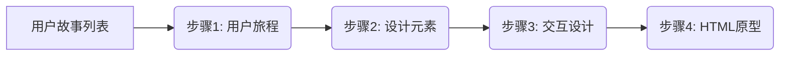

# AI辅助原型设计实战演练指南

> **📌 演练目标**: 本演练将引导你使用AI工具，从零散的用户故事出发，通过结构化的提示词工程，一步步生成高质量、可交互的HTML原型。

---

## 🗺️ 演练全景图

本次演练分为四个循序渐进的步骤，每一步都由专门的RTGO提示词支持：

---

## 🚀 演练步骤

### 第一步：生成用户旅程 (User Journey)

当你只有离散的用户故事，缺乏对用户完整操作流程的宏观视角时，使用此步骤。

- **🎯 目标**: 将碎片化的用户故事串联成连贯的用户旅程。
- **📥 输入**: 你的用户故事列表。
- **🛠️ 工具**: [任务0-用户旅程生成提示词.md](任务0-用户旅程生成提示词.md)
- **📤 输出**: 包含5-8个关键阶段的用户旅程全景图。

### 第二步：设计元素分析 (Design Elements)

有了用户旅程后，我们需要识别页面上的具体内容（组件、字段）。

- **🎯 目标**: 确定页面结构、UI组件清单和数据字段定义。
- **📥 输入**: 
  1. 第一步生成的**用户旅程**
  2. 原始的**用户故事列表**
- **🛠️ 工具**: [任务1-设计元素分析提示词-v2.md](任务1-设计元素分析提示词-v2.md)
- **📤 输出**: 页面结构表、UI组件清单、数据字段定义表。

### 第三步：交互设计与流程 (Interaction Design)

静态元素确定后，需要定义它们如何动起来，以及如何响应用户操作。

- **🎯 目标**: 设计交互流程、状态流转和反馈机制。
- **📥 输入**: 第二步生成的**设计元素分析文档**。
- **🛠️ 工具**: [任务2-交互设计提示词-v2.md](任务2-交互设计提示词-v2.md)
- **📤 输出**: PlantUML交互流程图、关键交互点说明、反馈机制设计。

### 第四步：生成HTML原型 (HTML Prototype)

最后，将所有设计规范转化为可运行的代码。

- **🎯 目标**: 生成可独立运行、包含完整样式的HTML原型。
- **📥 输入**: 
  1. 第二步的**设计元素**
  2. 第三步的**交互流程**
- **🛠️ 工具**: [任务3-HTML原型生成提示词-v2.md](任务3-HTML原型生成提示词-v2.md)
- **📤 输出**: 一个完整的 `.html` 文件（包含CSS样式和JS逻辑）。

---

## 💡 最佳实践建议

1. **保持上下文连贯**: 在同一个AI对话窗口中完成所有步骤，或者在每一步开始时，将上一步的输出完整粘贴给AI。
2. **循序渐进**: 不要试图直接跳到第四步。前三步的分析质量直接决定了最终代码的质量。
3. **人工微调**: AI生成的代码可能需要微调，特别是复杂的CSS样式或特定的业务逻辑。
4. **迭代优化**: 如果生成的原型不理想，检查第二步或第三步的输入是否不够详细，补充细节后重新生成。

---

## 🏁 开始演练

请打开 [任务0-用户旅程生成提示词.md](任务0-用户旅程生成提示词.md) 开始你的第一步！
