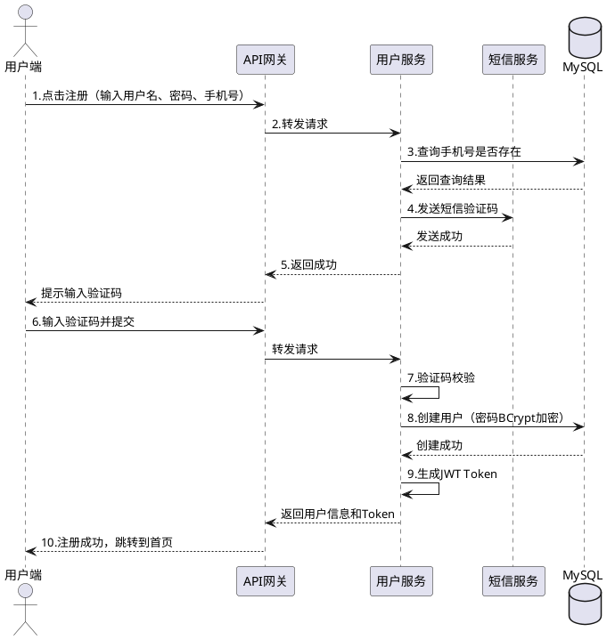

# HLD概要设计知识体系与模板

> **📌 文档说明**: 本文档详细介绍HLD（High-Level Design，概要设计）的核心概念、标准模板、知识体系和AI赋能的生成流程。

---

## 📚 一、HLD概要设计核心概念

### 什么是HLD？

**HLD（High-Level Design，概要设计/高层设计）**是软件设计阶段的第二步，位于架构设计（SAD）和详细设计（LLD）之间：

```
需求分析 → 架构设计(SAD) → [架构评审] → 概要设计(HLD) → [概要设计评审] → 详细设计(LLD) → 开发
```

### HLD与SAD、LLD的区别

| 设计阶段 | 关注点 | 输出文档 | 粒度 | 受众 |
|---------|-------|---------|------|------|
| **架构设计(SAD)** | 技术选型、系统分层、部署架构、非功能需求 | 架构决策记录(ADR)、架构蓝图 | 系统级 | 架构师、管理层、技术委员会 |
| **概要设计(HLD)** | 模块划分、接口设计、数据库设计、交互流程 | 概要设计文档、模块说明书 | 模块级 | 开发Leader、高级开发、测试经理 |
| **详细设计(LLD)** | 类图设计、方法实现、异常处理、代码规范 | 详细设计文档、类设计说明 | 类/方法级 | 开发工程师、测试工程师 |

### HLD的核心内容（4大模块）

根据软件设计完整流程，HLD包含：

1. **模块划分**：将系统拆分为功能模块、服务、组件
2. **接口设计**：定义模块间的API接口、数据格式、通信协议
3. **数据库设计**：设计ER模型、表结构、索引策略
4. **交互流程**：设计用户操作流程、系统交互时序

---

## 📋 二、HLD文档标准模板

### 模板结构（IEEE推荐）

```markdown
# 【项目名称】概要设计文档（HLD）

> **文档版本**: v1.0  
> **编写日期**: 2026-01-06  
> **编写人**: 架构组  
> **评审状态**: 待评审  
> **关联文档**: 
> - [需求规格说明书(SRS)](link)
> - [架构设计文档(SAD)](link)

---

## 1. 引言

### 1.1 文档目的
本文档描述【项目名称】的概要设计方案，定义系统的模块划分、接口设计、数据库设计和交互流程，为详细设计和开发提供指导。

### 1.2 预期读者
- 开发Leader：指导模块开发分工
- 高级开发工程师：理解系统架构和接口设计
- 测试经理：制定集成测试计划
- 项目经理：评估开发工作量和进度

### 1.3 术语与缩写
| 术语 | 全称 | 说明 |
|------|------|------|
| HLD | High-Level Design | 概要设计 |
| API | Application Programming Interface | 应用程序接口 |
| ER | Entity-Relationship | 实体关系模型 |

### 1.4 参考文档
- [需求规格说明书 v2.0]
- [架构设计文档 v1.5]
- [数据字典 v1.0]

---

## 2. 系统概述

### 2.1 系统架构回顾
{引用SAD中的系统架构图，简要说明系统分层和技术栈}

### 2.2 设计范围
本HLD文档覆盖以下模块：
- ✅ 模块A（用户管理模块）
- ✅ 模块B（推荐引擎模块）
- ✅ 模块C（数据处理模块）
- ⏳ 模块D（后续迭代）

### 2.3 设计约束
- 技术约束：基于Spring Boot 3.x、MySQL 8.0、Redis 7.x
- 性能约束：API响应时间P95<300ms、并发用户≥10000
- 安全约束：符合等保三级要求、敏感数据加密存储

---

## 3. 模块划分设计

### 3.1 模块分解原则
- 高内聚低耦合：模块内部功能紧密相关，模块间依赖最小化
- 单一职责：每个模块只负责一个业务领域
- 可复用性：通用功能抽取为独立模块

### 3.2 模块架构图

```
┌─────────────────────────────────────────────────┐
│                前端层（Web/App）                  │
└───────────────────┬─────────────────────────────┘
                    │ HTTP/HTTPS
┌───────────────────┼─────────────────────────────┐
│              API网关层（Gateway）                 │
│  - 路由转发  - 身份认证  - 限流熔断              │
└───────────────────┬─────────────────────────────┘
                    │
        ┌───────────┼───────────┐
        │           │           │
┌───────▼────┐ ┌───▼────┐ ┌───▼────────┐
│ 用户管理服务 │ │ 推荐服务 │ │ 订单服务    │
│ (User)     │ │(Recommend)│ │ (Order)    │
└───────┬────┘ └───┬────┘ └───┬────────┘
        │          │          │
        └──────────┼──────────┘
                   │
        ┌──────────┼──────────┐
        │          │          │
┌───────▼────┐ ┌──▼───────┐ ┌▼──────────┐
│ MySQL主库   │ │ Redis缓存 │ │ MQ消息队列 │
└────────────┘ └──────────┘ └───────────┘
```

### 3.3 模块清单

#### 模块1：用户管理服务（User Service）

**功能职责**：
- 用户注册、登录、注销
- 用户信息管理（个人资料、密码、头像）
- 用户权限管理（RBAC）

**技术栈**：
- Spring Boot 3.2 + Spring Security + JWT
- MySQL（用户表、角色表、权限表）
- Redis（Session缓存）

**接口清单**（详见第4章）：
- POST /api/users/register - 用户注册
- POST /api/users/login - 用户登录
- GET /api/users/{id} - 查询用户信息
- PUT /api/users/{id} - 更新用户信息

**依赖关系**：
- 无上游依赖
- 下游调用：消息服务（发送短信验证码）

---

#### 模块2：推荐服务（Recommend Service）

**功能职责**：
- 基于协同过滤算法生成推荐列表
- 新用户冷启动推荐（基于热门榜单）
- 推荐结果缓存和预计算

**技术栈**：
- Spring Boot 3.2 + Python算法服务（Surprise库）
- MySQL（用户行为表、推荐结果表）
- Redis（推荐结果缓存）

**接口清单**：
- GET /api/recommend/personal/{userId} - 个性化推荐
- GET /api/recommend/hot - 热门推荐
- POST /api/recommend/feedback - 用户反馈

**依赖关系**：
- 上游依赖：用户管理服务（用户身份验证）
- 下游调用：数据处理服务（获取用户行为数据）

---

### 3.4 模块部署视图

```
【生产环境】
┌─────────────────────────────────────────┐
│ Nginx负载均衡（2台）                      │
└────────────┬────────────────────────────┘
             │
    ┌────────┼────────┐
    │                 │
┌───▼─────┐     ┌────▼──────┐
│ User服务 │     │ Recommend │
│ (3实例)  │     │ 服务(2实例)│
└─────────┘     └───────────┘
    │                 │
    └────────┬────────┘
             │
┌────────────▼─────────────┐
│ MySQL主从集群（1主2从）   │
└──────────────────────────┘
```

---

## 4. 接口设计

### 4.1 接口设计原则
- RESTful风格：使用HTTP方法（GET/POST/PUT/DELETE）
- 统一响应格式：包含code、message、data字段
- 版本控制：URL包含版本号（如/api/v1/）
- 幂等性：PUT/DELETE操作必须幂等

### 4.2 统一响应格式

```json
// 成功响应
{
  "code": 200,
  "message": "success",
  "data": {
    "userId": "123",
    "username": "张三"
  },
  "timestamp": 1704528000000
}

// 失败响应
{
  "code": 400,
  "message": "参数校验失败：手机号格式错误",
  "data": null,
  "timestamp": 1704528000000
}
```

### 4.3 接口详细定义

#### 接口1：用户注册

**基本信息**：
- **接口名称**: 用户注册
- **请求方式**: POST
- **请求路径**: /api/v1/users/register
- **负责模块**: 用户管理服务

**请求参数**：

| 参数名 | 类型 | 必填 | 说明 | 示例 | 校验规则 |
|--------|------|------|------|------|----------|
| username | String | 是 | 用户名 | zhangsan | 4-20字符，字母数字下划线 |
| password | String | 是 | 密码 | Abc123456 | 8-20字符，包含大小写字母+数字 |
| phone | String | 是 | 手机号 | 13800138000 | 11位数字 |
| code | String | 是 | 验证码 | 123456 | 6位数字 |

**请求示例**：
```json
POST /api/v1/users/register
Content-Type: application/json

{
  "username": "zhangsan",
  "password": "Abc123456",
  "phone": "13800138000",
  "code": "123456"
}
```

**响应参数**：

| 参数名 | 类型 | 说明 |
|--------|------|------|
| userId | String | 用户ID |
| username | String | 用户名 |
| token | String | JWT令牌（有效期24小时） |

**响应示例**：
```json
{
  "code": 200,
  "message": "注册成功",
  "data": {
    "userId": "1001",
    "username": "zhangsan",
    "token": "eyJhbGciOiJIUzI1NiIsInR5cCI6IkpXVCJ9..."
  },
  "timestamp": 1704528000000
}
```

**异常处理**：

| 错误码 | 错误信息 | 处理方式 |
|--------|---------|---------|
| 40001 | 用户名已存在 | 提示用户更换用户名 |
| 40002 | 手机号已注册 | 提示用户直接登录 |
| 40003 | 验证码错误或已过期 | 重新发送验证码 |

---

## 5. 数据库设计

### 5.1 数据库架构

```
【主从架构】
Master（写入）
  ↓ 主从复制
Slave1（读取）
Slave2（读取）

【分库分表策略】
- 用户表：按userId取模分16个库
- 订单表：按orderId范围分表（每月一张表）
```

### 5.2 ER实体关系图

```
┌────────────┐       ┌────────────┐
│   User     │ 1   n │  UserRole  │
│ 用户表     ├───────┤ 用户角色表 │
└────────────┘       └────────────┘
      │ 1                  n │
      │                      │
      │ n              ┌─────▼─────┐
      │                │   Role    │
┌─────▼─────┐          │  角色表   │
│  Order    │          └───────────┘
│  订单表   │
└───────────┘
      │ 1
      │
      │ n
┌─────▼─────┐
│ OrderItem │
│ 订单明细表 │
└───────────┘
```

### 5.3 数据表设计

#### 表1：用户表（t_user）

**表说明**：存储用户基本信息和认证信息

| 字段名 | 类型 | 长度 | 主键 | 非空 | 默认值 | 说明 | 索引 |
|--------|------|------|------|------|--------|------|------|
| user_id | BIGINT | - | ✅ | ✅ | 自增 | 用户ID | PRIMARY |
| username | VARCHAR | 50 | - | ✅ | - | 用户名 | UNIQUE |
| password | VARCHAR | 128 | - | ✅ | - | 密码（加密） | - |
| phone | VARCHAR | 11 | - | ✅ | - | 手机号 | UNIQUE |
| email | VARCHAR | 100 | - | - | NULL | 邮箱 | INDEX |
| nickname | VARCHAR | 50 | - | - | NULL | 昵称 | - |
| avatar | VARCHAR | 255 | - | - | NULL | 头像URL | - |
| gender | TINYINT | - | - | - | 0 | 性别（0未知/1男/2女） | - |
| birthday | DATE | - | - | - | NULL | 生日 | - |
| status | TINYINT | - | - | ✅ | 1 | 状态（0禁用/1启用） | INDEX |
| create_time | DATETIME | - | - | ✅ | CURRENT_TIMESTAMP | 创建时间 | INDEX |
| update_time | DATETIME | - | - | ✅ | CURRENT_TIMESTAMP ON UPDATE | 更新时间 | - |

**索引设计**：
```sql
-- 主键索引
PRIMARY KEY (user_id)

-- 唯一索引
UNIQUE INDEX uk_username (username)
UNIQUE INDEX uk_phone (phone)

-- 普通索引
INDEX idx_email (email)
INDEX idx_status_create_time (status, create_time)  -- 复合索引，用于分页查询
```

**建表SQL**：
```sql
CREATE TABLE t_user (
  user_id BIGINT NOT NULL AUTO_INCREMENT COMMENT '用户ID',
  username VARCHAR(50) NOT NULL COMMENT '用户名',
  password VARCHAR(128) NOT NULL COMMENT '密码（BCrypt加密）',
  phone VARCHAR(11) NOT NULL COMMENT '手机号',
  email VARCHAR(100) DEFAULT NULL COMMENT '邮箱',
  nickname VARCHAR(50) DEFAULT NULL COMMENT '昵称',
  avatar VARCHAR(255) DEFAULT NULL COMMENT '头像URL',
  gender TINYINT DEFAULT 0 COMMENT '性别（0未知/1男/2女）',
  birthday DATE DEFAULT NULL COMMENT '生日',
  status TINYINT NOT NULL DEFAULT 1 COMMENT '状态（0禁用/1启用）',
  create_time DATETIME NOT NULL DEFAULT CURRENT_TIMESTAMP COMMENT '创建时间',
  update_time DATETIME NOT NULL DEFAULT CURRENT_TIMESTAMP ON UPDATE CURRENT_TIMESTAMP COMMENT '更新时间',
  PRIMARY KEY (user_id),
  UNIQUE KEY uk_username (username),
  UNIQUE KEY uk_phone (phone),
  KEY idx_email (email),
  KEY idx_status_create_time (status, create_time)
) ENGINE=InnoDB DEFAULT CHARSET=utf8mb4 COMMENT='用户表';
```

---

## 6. 交互流程设计

### 6.1 用户注册流程（时序图）

```
用户端      →    API网关    →   用户服务   →   短信服务   →   MySQL
  │                │               │              │            │
  │ 1.点击注册      │               │              │            │
  ├────────────────>               │              │            │
  │                │ 2.转发请求    │              │            │
  │                ├──────────────>│              │            │
  │                │               │ 3.查询手机号是否存在      │
  │                │               ├─────────────────────────>│
  │                │               │<─────────────────────────┤
  │                │               │ 4.发送短信验证码          │
  │                │               ├────────────>│            │
  │                │               │<────────────┤            │
  │                │ 5.返回成功    │              │            │
  │                │<──────────────┤              │            │
  │<────────────────                              │            │
  │                                               │            │
  │ 6.输入验证码并提交                             │            │
  ├────────────────>                              │            │
  │                ├──────────────>               │            │
  │                │               │ 7.验证码校验  │            │
  │                │               │ 8.创建用户    │            │
  │                │               ├─────────────────────────>│
  │                │               │<─────────────────────────┤
  │                │               │ 9.生成JWT Token          │
  │                │<──────────────┤              │            │
  │<────────────────                              │            │
  │ 10.跳转到首页                                  │            │
```

**PlantUML代码**：


---

## 7. 非功能需求设计

### 7.1 性能设计

| 指标 | 目标值 | 监控方式 | 优化方案 |
|------|--------|---------|---------|
| API响应时间 | P95<300ms | Prometheus + Grafana | Redis缓存、数据库索引优化 |
| 并发用户数 | ≥10000 | JMeter压测 | 水平扩展、连接池优化 |
| 数据库QPS | ≥5000 | MySQL慢查询日志 | 读写分离、分库分表 |
| 推荐算法延迟 | <200ms | 自定义Metric | 预计算 + Redis缓存 |

### 7.2 安全设计

| 安全措施 | 实现方案 |
|---------|---------|
| 身份认证 | JWT Token（有效期24小时） + RefreshToken |
| 数据加密 | 密码BCrypt加密、敏感字段AES-256加密 |
| 传输加密 | HTTPS（TLS 1.3） |
| SQL注入防护 | MyBatis PreparedStatement |
| XSS防护 | 前端输入过滤、后端输出转义 |
| CSRF防护 | Token验证 |

### 7.3 可用性设计

| 措施 | 目标 | 实现方案 |
|------|------|---------|
| 服务可用率 | ≥99.9% | 主从热备、服务降级 |
| 数据备份 | RPO≤5分钟 | MySQL binlog + 增量备份 |
| 故障恢复 | RTO≤30分钟 | 自动故障转移、健康检查 |

---

## 8. 概要设计评审清单

### 8.1 评审维度

| 维度 | 检查项 | 通过标准 |
|------|--------|---------|
| **完整性** | 模块划分完整、接口定义完整、数据库设计完整 | 覆盖所有需求 |
| **正确性** | 模块职责正确、接口参数正确、数据表结构合理 | 无逻辑错误 |
| **一致性** | 与SAD架构一致、与SRS需求一致、术语一致 | 无冲突 |
| **可实现性** | 技术方案可行、性能指标可达、时间估算合理 | 无重大风险 |
| **可维护性** | 模块低耦合、接口易扩展、数据库易维护 | 符合规范 |

### 8.2 评审检查表

```markdown
## HLD评审检查表

### 1. 模块划分（20分）
- [ ] 模块职责清晰，符合单一职责原则（5分）
- [ ] 模块间依赖关系明确，无循环依赖（5分）
- [ ] 模块粒度合理，便于开发分工（5分）
- [ ] 模块部署方案可行，符合架构约束（5分）

### 2. 接口设计（25分）
- [ ] 接口命名规范，符合RESTful风格（5分）
- [ ] 接口参数完整，包含校验规则（5分）
- [ ] 接口响应格式统一（5分）
- [ ] 异常处理完整，错误码定义清晰（5分）
- [ ] 性能要求明确，有降级方案（5分）

### 3. 数据库设计（25分）
- [ ] ER模型正确，实体关系清晰（5分）
- [ ] 表结构设计合理，字段类型正确（5分）
- [ ] 索引设计合理，覆盖查询场景（5分）
- [ ] 分库分表策略可行（5分）
- [ ] 数据量预估合理（5分）

### 4. 交互流程（15分）
- [ ] 时序图完整，步骤清晰（5分）
- [ ] 异常处理完整（5分）
- [ ] 性能优化方案可行（5分）

### 5. 非功能需求（15分）
- [ ] 性能指标量化，可监控（5分）
- [ ] 安全措施完整，符合等保要求（5分）
- [ ] 可用性设计合理（5分）

**总分**: 100分  
**通过标准**: ≥80分（且无P0问题）
```

---

## 🤖 三、AI赋能的HLD生成流程

### 3.1 AI生成HLD的完整工作流

```
【输入】                    【AI处理】                   【输出】
Epic分析报告  ──────────> AI生成模块划分 ──────────> 模块清单 + 依赖关系图
Story列表                  ↓
SAD架构文档    ──────────> AI生成接口整合 ──────────> 统一接口文档 + Swagger
Story级接口设计            ↓
                  AI生成数据库整合 ──────────> 完整ER图 + 建表SQL
Story级数据表设计          ↓
                  AI生成交互流程 ──────────> 时序图 + 异常处理
                           ↓
【人工评审】<──────────── AI生成完整HLD文档
```

### 3.2 HLD与Story级设计的关系

**Story级设计（自底向上）**：
- 输入：单个User Story
- 输出：该Story需要的接口（1-3个）、数据表（1-2张）
- 特点：局部视角、快速迭代、开发人员可直接实现

**HLD概要设计（自顶向下）**：
- 输入：所有Story列表 + Epic + SAD
- 输出：完整的模块划分、接口规范、ER模型、交互流程
- 特点：全局视角、系统性、架构师主导

**两者关系**：
1. **互补关系**：Story级设计关注"怎么做"，HLD关注"怎么组织"
2. **整合关系**：HLD需要整合所有Story的接口和数据表，形成统一视图
3. **一致性校验**：HLD阶段需要检查Story级设计的一致性（命名、规范、冲突）

### 3.3 HLD提示词工作流

本目录下提供5个RTGO规范的HLD生成提示词：

1. **HLD-01-模块划分提示词.md**
   - 输入：Epic + Story列表 + SAD
   - 输出：模块清单、依赖关系图、部署视图

2. **HLD-02-接口设计提示词.md**
   - 输入：Story列表 + Story级接口设计 + 模块划分结果
   - 输出：统一接口文档、Swagger规范、接口依赖关系

3. **HLD-03-数据库设计提示词.md**
   - 输入：Story列表 + Story级数据表设计 + 模块划分结果
   - 输出：完整ER图、建表SQL、索引优化、分库分表策略

4. **HLD-04-时序图设计提示词.md**
   - 输入：关键User Story + 接口设计 + 模块划分
   - 输出：PlantUML时序图、异常处理流程

5. **HLD-05-概要设计评审提示词.md**
   - 输入：完整的HLD文档（模块+接口+数据库+时序图）
   - 输出：评审报告、问题清单、改进建议

---

## 📚 四、参考资源

### 相关标准

- **IEEE 1016-2009**: Software Design Descriptions（软件设计描述标准）
- **ISO/IEC 25010**: Systems and software Quality Requirements and Evaluation（质量模型）
- **C4 Model**: Context, Containers, Components, Code（架构可视化模型）

### 推荐工具

- **接口文档**: Swagger/Apifox/Postman
- **数据库设计**: PowerDesigner/dbdiagram.io/MySQL Workbench
- **流程图**: PlantUML/draw.io/Mermaid
- **ER图**: dbdiagram.io/ERDPlus/Lucidchart

---

**🎉 现在可以开始使用HLD-01到HLD-05提示词生成概要设计文档！**
