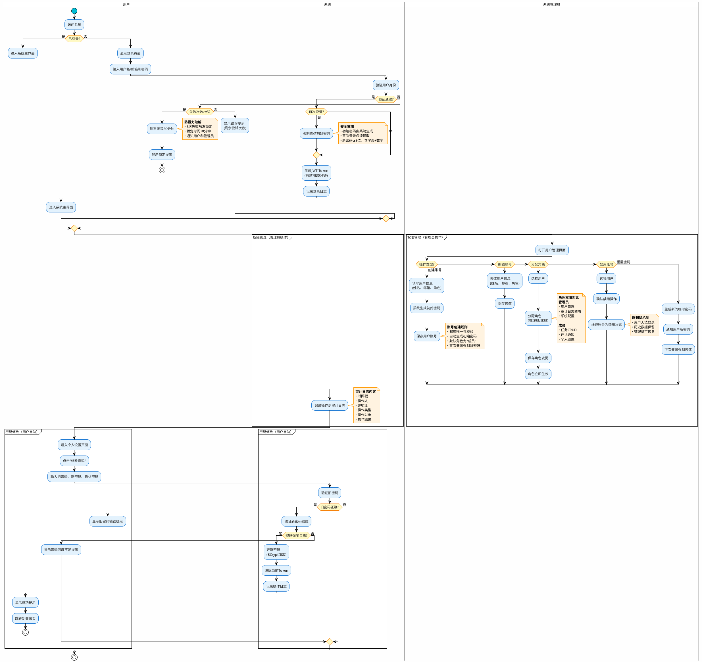
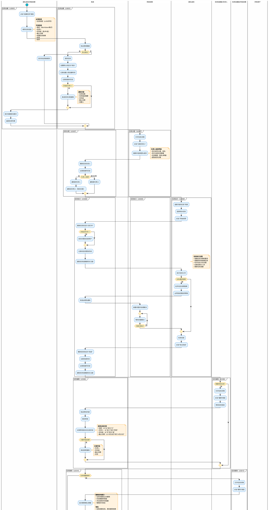
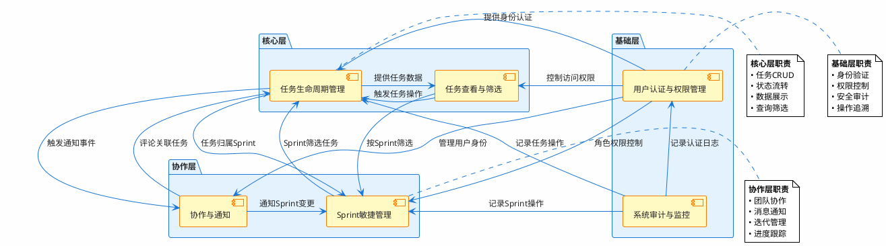

```plantuml
@startuml 系统审计与监控流程
!theme plain
skinparam backgroundColor #FEFEFE
skinparam defaultFontName Microsoft YaHei
skinparam defaultFontSize 12

' Blue Analyst Theme Colors
skinparam activity {
  BackgroundColor #E3F2FD
  BorderColor #1976D2
  FontColor #212121
  StartColor #00BCD4
  EndColor #009688
  BarColor #1976D2
}

skinparam activityDiamond {
  BackgroundColor #FFF9C4
  BorderColor #F57C00
  FontColor #212121
}

skinparam note {
  BackgroundColor #FFF3E0
  BorderColor #FF9800
}

|系统|
start

partition "自动审计记录" {
  :监听系统业务事件;
  
  fork
    :用户登录事件;
  fork again
    :密码修改事件;
  fork again
    :任务CRUD事件;
  fork again
    :权限变更事件;
  fork again
    :Sprint管理事件;
  end fork
  
  :捕获事件详情;
  note right
    **审计日志字段**
    🔐 **身份信息**
    • 操作人ID
    • 操作人姓名
    • IP地址
    • User Agent
    
    ⏰ **时间信息**
    • 操作时间戳
    • 时区
    
    📝 **操作信息**
    • 操作类型
    • 操作对象（任务/用户/Sprint）
    • 操作对象ID
    • 操作前数据
    • 操作后数据
    • 操作结果（成功/失败）
    • 失败原因
  end note
  
  :异步写入审计日志表;
  note right
    **异步写入优势**
    • 不阻塞业务操作
    • 提高系统性能
    • 日志写入失败不影响业务
    
    **异步实现**
    • 消息队列（RabbitMQ/Kafka）
    • 批量写入
    • 失败重试机制
  end note
  
  if (日志写入成功?) then (是)
    :日志持久化到数据库;
  else (否)
    :记录到错误日志;
    :触发告警;
  endif
}

partition "操作历史查看（US011）" {
  |用户|
  :打开任务详情页;
  :切换到"历史"选项卡;
  
  |系统|
  :查询任务操作历史;
  :按时间倒序加载;
  note right
    **操作历史内容**
    🎬 **任务创建**
    • 2026-04-25 10:00
    • 张三创建任务
    • 初始状态：待办
    
    🔄 **状态变更**
    • 2026-04-25 14:30
    • 李四更新状态
    • 从"待办"→"进行中"
    
    👤 **负责人变更**
    • 2026-04-26 09:00
    • 项目经理分配负责人
    • 从"张三"→"李四"
    
    ✏️ **字段修改**
    • 2026-04-26 11:00
    • 李四修改优先级
    • 从"中"→"高"
  end note
  
  :使用时间线样式展示;
  :变更对比使用差异高亮;
  
  |用户|
  if (需要筛选历史?) then (是)
    :选择筛选条件;
    note right
      **筛选选项**
      • 按操作类型
      • 按操作人
      • 按时间范围
    end note
    
    |系统|
    :按条件过滤历史记录;
  endif
  
  :分页加载历史记录;
}

partition "审计日志查看（US025）" {
  |系统管理员|
  :登录系统（管理员权限）;
  :打开"审计日志"菜单;
  
  |系统|
  :验证管理员权限;
  
  if (有权限?) then (是)
    :加载审计日志列表;
    note right
      **审计日志列表**
      📋 **列表列**
      • 时间
      • 操作人
      • IP地址
      • 操作类型
      • 操作对象
      • 操作结果
      • 详情按钮
      
      📊 **默认排序**
      • 按时间倒序
      • 最近操作在前
    end note
    
    :分页展示（每页50条）;
    
    |系统管理员|
    partition "日志筛选" {
      if (需要筛选日志?) then (是)
        :打开筛选面板;
        :选择筛选条件;
        note right
          **筛选维度**
          📅 **时间范围**
          • 今天
          • 昨天
          • 最近7天
          • 最近30天
          • 自定义范围
          
          👤 **操作人**
          • 选择用户（多选）
          • 搜索用户名
          
          🏷️ **操作类型**
          • 登录/登出
          • 密码修改
          • 用户管理
          • 任务操作
          • 权限变更
          • Sprint管理
          
          ✅ **操作结果**
          • 成功
          • 失败
        end note
        
        |系统|
        :按条件查询审计日志;
        :显示筛选结果;
      endif
    }
    
    partition "日志详情查看" {
      |系统管理员|
      if (需要查看详情?) then (是)
        :点击某条日志的"详情"按钮;
        
        |系统|
        :加载日志完整信息;
        note right
          **日志详情内容**
          🔐 **身份信息**
          • 操作人：张三
          • IP地址：192.168.1.100
          • User Agent：Chrome/120.0
          
          ⏰ **时间信息**
          • 操作时间：2026-04-25 14:30:25
          • 时区：UTC+8
          
          📝 **操作信息**
          • 操作类型：任务删除
          • 操作对象：任务#123
          • 操作对象名称："优化登录页面"
          
          📊 **数据对比**
          • 操作前：{...任务完整数据}
          • 操作后：{deleted: true}
          
          ✅ **操作结果**
          • 结果：成功
        end note
        
        :弹窗展示详情;
      endif
    }
    
    partition "日志导出" {
      |系统管理员|
      if (需要导出日志?) then (是)
        :选择导出范围;
        :选择导出格式;
        note right
          **导出格式**
          • CSV
          • Excel
          • JSON
        end note
        
        |系统|
        :生成导出文件;
        :下载文件;
        note right
          **导出限制**
          • 单次最多导出10000条
          • 大批量导出异步生成
          • 导出记录到审计日志
        end note
      endif
    }
    
    partition "安全审计分析" {
      |系统管理员|
      if (发现异常?) then (是)
        note right
          **异常识别**
          🔴 **高风险**
          • 短时间多次登录失败
          • 权限越权尝试
          • 批量数据删除
          • 非工作时间登录
          
          🟡 **中风险**
          • 异常IP登录
          • 跨地域登录
          • 频繁密码修改
        end note
        
        :分析异常日志;
        :联系相关用户确认;
        
        if (确认为安全威胁?) then (是)
          :锁定相关账号;
          :通知安全团队;
          :生成安全事件报告;
        else (否)
          :记录为正常行为;
        endif
      endif
    }
    
  else (否)
    :显示权限不足提示;
    stop
  endif
}

partition "日志归档与清理" {
  |系统定时任务|
  :每日凌晨执行;
  
  :查询180天前的日志;
  
  if (有待归档日志?) then (是)
    :导出日志到归档文件;
    :压缩归档文件;
    :转移到归档存储;
    :删除数据库中的旧日志;
    note right
      **归档策略**
      • 保留期：180天
      • 归档格式：压缩JSON
      • 归档路径：/backup/audit_logs/
      • 命名规则：audit_2026_04.json.gz
      
      **归档后查询**
      • 管理员可申请查询归档日志
      • 需要审批流程
      • 恢复到临时表查询
    end note
  endif
}

stop

@enduml
```

# 任务管理系统 - 业务流程分析

> **文档编号**: EPIC-001-BP  
> **生成日期**: 2026年4月25日  
> **依据文档**: 用户故事列表-任务管理系统.md  
> **PlantUML主题**: Blue Analyst（专业理性·逻辑清晰）

---

## 📊 业务流程概览

本文档基于25个用户故事，梳理了任务管理系统的6大核心业务流程：

1. **用户认证与权限管理流程** - 用户登录、账号管理、权限分配
2. **任务完整生命周期流程** - 从创建到完成的全流程
3. **任务查看与筛选流程** - 多视图展示、搜索筛选
4. **协作与通知流程** - 评论、@提及、通知推送
5. **Sprint敏捷管理流程** - Sprint创建、任务分配、进度统计
6. **系统审计与监控流程** - 操作历史、审计日志

---

## 1️⃣ 用户认证与权限管理流程

### 流程描述

用户认证与权限管理是系统的基础功能，确保只有授权人员可以访问系统。流程包括：

- **用户登录**（US001）：用户使用账号密码登录，系统验证身份并生成JWT Token
- **账号管理**（US002）：系统管理员创建、编辑、禁用团队成员账号
- **权限分配**（US003）：系统管理员为用户分配角色（管理员/成员），控制操作权限
- **密码修改**（US004）：用户定期修改密码，保障账号安全
- **审计日志**（US025）：记录所有关键操作，支持安全审计和问题排查

**关键特性**：
- ✅ JWT Token身份认证（30分钟有效期）
- ✅ BCrypt密码加密存储
- ✅ 基于角色的访问控制（RBAC）
- ✅ 登录失败5次锁定30分钟
- ✅ 所有操作记录审计日志

### PlantUML流程图



---

## 2️⃣ 任务完整生命周期流程

### 流程描述

任务生命周期是系统的核心业务流程，涵盖任务从创建到完成的全过程：

- **任务创建**（US005）：团队成员或项目经理创建新任务，填写标题、描述、负责人、优先级等信息
- **任务分配**（US007）：项目经理为任务指定负责人，明确责任归属
- **任务执行**（US008）：团队成员更新任务状态（待办→进行中→完成）
- **任务编辑**（US006）：任务创建者或负责人修改任务信息
- **任务查看**（US009）：所有用户查看任务详情，了解任务目标和进展
- **任务删除**（US010）：任务创建者或项目经理删除无效任务
- **操作历史**（US011）：系统自动记录任务的所有变更历史

**任务状态流转**：
```
待办（To Do） → 进行中（In Progress） → 完成（Done）
      ↓               ↓                    ↓
    可回退           可回退                可回退
```

**关键特性**：
- ✅ 支持Markdown格式描述
- ✅ 任务依赖关系管理
- ✅ 附件上传（图片、文档、链接）
- ✅ 优先级（高/中/低）可视化
- ✅ 所有操作自动记录历史

### PlantUML流程图



---

## 3️⃣ 任务查看与筛选流程

### 流程描述

任务查看与筛选功能帮助用户快速定位和浏览任务：

- **列表视图**（US012）：表格形式展示任务，支持排序、分组、分页
- **看板视图**（US013）：三列看板（待办/进行中/完成），直观展示任务流转
- **看板拖拽**（US014）：拖拽任务卡片跨列移动，快速更新状态
- **任务搜索**（US015）：通过关键词搜索任务标题和描述
- **多维度筛选**（US016）：按状态、负责人、优先级、标签、截止日期筛选
- **筛选偏好保存**（US017）：记住用户的筛选条件，下次自动应用

**视图对比**：
| 特性 | 列表视图 | 看板视图 |
|------|---------|---------|
| 展示形式 | 表格 | 卡片列 |
| 适用场景 | 详细浏览、数据分析 | 进度把控、状态管理 |
| 排序支持 | ✅ 多列排序 | ✅ 按优先级+日期 |
| 拖拽操作 | ❌ | ✅ 拖拽更新状态 |
| 移动端 | ✅ 卡片列表 | ✅ 降级为列表 |

### PlantUML流程图

```plantuml
@startuml 任务查看与筛选流程
!theme plain
skinparam backgroundColor #FEFEFE
skinparam defaultFontName Microsoft YaHei
skinparam defaultFontSize 12

' Blue Analyst Theme Colors
skinparam activity {
  BackgroundColor #E3F2FD
  BorderColor #1976D2
  FontColor #212121
  StartColor #00BCD4
  EndColor #009688
  BarColor #1976D2
}

skinparam activityDiamond {
  BackgroundColor #FFF9C4
  BorderColor #F57C00
  FontColor #212121
}

skinparam note {
  BackgroundColor #FFF3E0
  BorderColor #FF9800
}

|用户|
start

:进入任务管理页面;

partition "视图选择" {
  if (选择视图类型?) then (列表视图)
    |系统|
    :加载任务列表数据;
    :应用用户筛选偏好;
    
    partition "列表视图操作（US012）" {
      :表格形式展示任务;
      note right
        **列表视图列**
        • 任务标题
        • 负责人（头像）
        • 优先级（颜色标识）
        • 截止日期
        • 状态（标签）
        • 创建时间
        • 快捷操作
      end note
      
      |用户|
      if (需要排序?) then (是)
        :点击列头排序;
        |系统|
        :按选定列排序;
        :保存排序偏好;
      endif
      
      if (需要分组?) then (是)
        |用户|
        :选择分组维度;
        note right
          **分组选项**
          • 按状态分组
          • 按负责人分组
          • 按优先级分组
          • 按Sprint分组
        end note
        |系统|
        :按分组展示任务;
        :显示每组任务数量;
      endif
      
      if (需要分页?) then (是)
        |用户|
        :选择每页显示数量\n(20/50/100);
        :翻页浏览;
      endif
    }
    
  else (看板视图)
    |系统|
    :加载任务数据;
    :应用用户筛选偏好;
    
    partition "看板视图操作（US013）" {
      :显示三列看板;
      note right
        **看板结构**
        📋 **待办列**
        • 显示待办任务卡片
        • 显示任务数量
        • 按优先级+日期排序
        
        🔄 **进行中列**
        • 显示进行中任务卡片
        • 突出显示临近截止任务
        
        ✅ **完成列**
        • 显示已完成任务
        • 显示完成时间
      end note
      
      :每列最多显示100个任务;
      
      |用户|
      if (需要泳道分组?) then (是)
        :选择泳道维度;
        note right
          **泳道选项**
          • 按负责人（横向分组）
          • 按Sprint（横向分组）
          • 按优先级（横向分组）
        end note
        |系统|
        :按泳道展示任务;
      endif
      
      partition "看板拖拽操作（US014）" {
        |用户|
        if (需要更新任务状态?) then (是)
          :鼠标按住任务卡片;
          :拖拽到目标列;
          
          |系统|
          :显示拖拽视觉反馈;
          note right
            **拖拽反馈**
            • 任务卡片半透明
            • 目标列高亮提示
            • 显示占位符位置
          end note
          
          |用户|
          :松开鼠标;
          
          |系统|
          if (有编辑权限?) then (是)
            :更新任务状态;
            :平滑动画移动卡片;
            :记录到操作历史;
            :发送状态变更通知;
            note right
              **状态映射**
              • 拖到"待办"列 → 状态改为"待办"
              • 拖到"进行中"列 → 状态改为"进行中"
              • 拖到"完成"列 → 状态改为"完成"
            end note
          else (否)
            :卡片回退到原位置;
            :显示权限不足提示;
          endif
        endif
      }
    }
  endif
}

partition "搜索功能（US015）" {
  |用户|
  if (需要搜索任务?) then (是)
    :在搜索框输入关键词;
    
    |系统|
    :实时搜索（防抖300ms）;
    :搜索范围：任务标题+描述;
    :模糊匹配，不区分大小写;
    
    :高亮匹配关键词;
    :显示搜索结果数量;
    note right
      **搜索优化**
      • 防抖：避免频繁请求
      • 历史记录：保存最近搜索
      • 清空按钮：快速重置
      • 空搜索：显示全部任务
    end note
    
    |用户|
    if (搜索结果满意?) then (否)
      :修改关键词重新搜索;
    endif
  endif
}

partition "筛选功能（US016）" {
  |用户|
  if (需要筛选任务?) then (是)
    :打开筛选面板;
    :选择筛选条件;
    note right
      **筛选维度**
      ✅ **状态**（多选）
      • 待办
      • 进行中
      • 完成
      
      ✅ **负责人**（多选）
      • 张三(15)
      • 李四(12)
      • 未分配(5)
      
      ✅ **优先级**（多选）
      • 高 🔴
      • 中 🟡
      • 低 🔵
      
      ✅ **标签**（多选）
      • Bug
      • Feature
      • 技术债务
      
      ✅ **截止日期**（范围）
      • 开始日期
      • 结束日期
      • 快捷选项（今天/本周/本月）
    end note
    
    |系统|
    :组合筛选条件（AND逻辑）;
    :实时更新任务列表;
    :显示已选筛选条件（Tag形式）;
    :显示筛选结果数量;
    
    |用户|
    if (需要调整筛选?) then (是)
      :单独移除某个条件;
      或
      :一键清空全部筛选;
    endif
  endif
}

partition "筛选偏好保存（US017）" {
  |系统|
  :自动保存当前筛选条件;
  :保存到后端（用户配置表）;
  note right
    **保存内容**
    • 筛选条件组合
    • 视图类型（列表/看板）
    • 排序方式
    • 分组设置
  end note
  
  |用户|
  if (常用筛选场景?) then (是)
    :点击"保存为预设筛选";
    :输入预设名称;
    note right
      **预设筛选示例**
      • "我的任务"：负责人=当前用户
      • "高优先级"：优先级=高
      • "本周到期"：截止日期=本周
      • "待分配"：负责人=空
    end note
    
    |系统|
    :保存预设筛选（最多5个）;
  endif
  
  :下次访问时自动应用上次筛选;
  note right
    **跨设备同步**
    • 筛选偏好保存到服务器
    • 不同设备自动同步
    • 预设筛选跨设备共享
  end note
}

:查看筛选后的任务列表;
:点击任务查看详情;

stop

@enduml
```

---

## 4️⃣ 协作与通知流程

### 流程描述

协作与通知功能促进团队成员之间的沟通，减少信息散落：

- **任务评论**（US018）：在任务详情页发表评论，讨论任务细节
- **@提及成员**（US019）：评论中@特定成员，引起注意
- **接收通知**（US020）：实时接收系统内通知（任务分配、状态变更、@提及等）
- **通知中心**（US021）：查看所有历史通知，回顾错过的消息

**通知场景矩阵**：
| 触发事件 | 接收人 | 通知类型 |
|---------|-------|---------|
| 任务分配 | 新负责人 | 系统通知 |
| 任务状态变更 | 创建者、关注者 | 系统通知 |
| @提及 | 被提及用户 | 系统通知 + 桌面通知 |
| 评论回复 | 被回复用户 | 系统通知 |
| 截止日期临近 | 任务负责人 | 系统通知 |

### PlantUML流程图

```plantuml
@startuml 协作与通知流程
!theme plain
skinparam backgroundColor #FEFEFE
skinparam defaultFontName Microsoft YaHei
skinparam defaultFontSize 12

' Blue Analyst Theme Colors
skinparam activity {
  BackgroundColor #E3F2FD
  BorderColor #1976D2
  FontColor #212121
  StartColor #00BCD4
  EndColor #009688
  BarColor #1976D2
}

skinparam activityDiamond {
  BackgroundColor #FFF9C4
  BorderColor #F57C00
  FontColor #212121
}

skinparam note {
  BackgroundColor #FFF3E0
  BorderColor #FF9800
}

|用户A|
start

partition "任务评论讨论（US018）" {
  :打开任务详情页;
  :切换到"评论"选项卡;
  :点击评论输入框;
  :撰写评论内容;
  note right
    **评论功能**
    • 支持Markdown格式
    • 支持表情符号
    • 支持@提及成员
    • 最多2000字符
    
    **Markdown支持**
    • **粗体**、*斜体*
    • 有序/无序列表
    • 代码块
    • 链接
  end note
  
  if (需要@提及成员?) then (是)
    partition "@提及功能（US019）" {
      :输入@符号;
      
      |系统|
      :显示成员选择器;
      note right
        **成员选择器**
        • 显示团队所有成员
        • 支持搜索（姓名/邮箱）
        • 显示成员头像
        • 高亮在线状态
      end note
      
      |用户A|
      :选择要@的成员;
      
      |系统|
      :在评论中插入@成员名称;
      :成员名称高亮显示;
    }
  endif
  
  :点击"发表评论"按钮;
  
  |系统|
  :验证评论内容;
  
  if (验证通过?) then (是)
    :保存评论;
    :渲染Markdown格式;
    :显示评论时间和作者;
    
    if (包含@提及?) then (是)
      :解析@的成员列表;
      
      fork
        :创建@提及通知;
        |被@的用户B|
        :收到@提及通知;
        note right
          **@提及通知**
          • 顶部通知图标红点
          • 桌面通知弹窗
          • 通知内容预览
          • 点击跳转到任务
        end note
      fork again
        |系统|
        :记录到操作历史;
      end fork
    endif
    
    :通知任务创建者和关注者;
  else (否)
    :显示验证错误提示;
  endif
}

partition "接收系统通知（US020）" {
  |系统后台|
  :监听业务事件;
  
  fork
    :任务分配事件;
  fork again
    :任务状态变更事件;
  fork again
    :@提及事件;
  fork again
    :评论回复事件;
  fork again
    :截止日期临近事件;
  end fork
  
  :生成通知消息;
  note right
    **通知消息结构**
    • 通知类型
    • 标题
    • 内容摘要
    • 相关任务ID
    • 触发人
    • 触发时间
    • 已读状态
  end note
  
  :通过WebSocket推送;
  或
  :轮询机制获取;
  
  |用户B|
  :收到实时通知;
  
  :顶部通知图标显示红点;
  note right
    **通知图标**
    • 🔔 + 红色数字标识
    • 显示未读通知数量
    • 实时更新
  end note
  
  if (启用桌面通知?) then (是)
    |系统|
    :请求浏览器通知权限;
    
    if (权限已授予?) then (是)
      :弹出桌面通知;
      note right
        **桌面通知内容**
        • 标题：任务名称
        • 内容：通知摘要
        • 点击跳转到任务
        • 自动消失（5秒）
      end note
    endif
  endif
  
  |用户B|
  if (点击通知图标?) then (是)
    :展开通知下拉列表;
    note right
      **通知列表**
      • 显示最近10条通知
      • 未读通知加粗显示
      • 点击通知跳转任务
      • "查看全部"按钮
      • "全部标记已读"按钮
    end note
    
    if (点击某条通知?) then (是)
      |系统|
      :标记该通知为已读;
      :跳转到相关任务页面;
    endif
    
    if (点击"全部标记已读"?) then (是)
      |系统|
      :批量标记未读通知为已读;
      :清除红点标识;
    endif
  endif
}

partition "通知中心（US021）" {
  |用户B|
  if (需要查看历史通知?) then (是)
    :点击"通知中心"菜单;
    
    |系统|
    :加载所有历史通知;
    :按时间倒序展示;
    note right
      **通知中心界面**
      📋 **筛选选项**
      • 全部通知
      • 仅未读
      • 按类型筛选
        - 任务分配
        - 状态变更
        - @提及
        - 评论回复
        - 截止提醒
      
      📅 **时间线展示**
      • 今天
      • 昨天
      • 本周
      • 更早
    end note
    
    :分页加载（每页20条）;
    
    |用户B|
    if (筛选通知?) then (是)
      :选择筛选条件;
      |系统|
      :按条件过滤通知;
    endif
    
    if (点击通知?) then (是)
      |系统|
      :标记为已读;
      :跳转到相关任务;
    endif
    
    if (删除通知?) then (是)
      :选择要删除的通知;
      |系统|
      :软删除通知;
      note right
        **删除规则**
        • 删除不影响任务本身
        • 仅隐藏通知消息
        • 不可恢复
      end note
    endif
  endif
}

partition "通知偏好设置" {
  |用户B|
  if (需要调整通知设置?) then (是)
    :进入个人设置页面;
    :打开"通知偏好";
    note right
      **通知偏好选项**
      ✅ 任务分配通知
      ✅ 任务状态变更通知
      ✅ @提及通知
      ✅ 评论回复通知
      ✅ 截止日期提醒
      ❌ 每日任务摘要（MVP不支持）
      
      🔔 **桌面通知**
      ✅ 启用桌面通知
      
      📧 **邮件通知**（二期功能）
      ❌ 启用邮件通知
    end note
    
    :保存通知偏好;
    
    |系统|
    :更新用户通知配置;
  endif
}

stop

@enduml
```

---

## 5️⃣ Sprint敏捷管理流程

### 流程描述

Sprint管理支持敏捷开发的迭代管理：

- **创建Sprint**（US022）：项目经理创建Sprint迭代周期，定义时间盒和目标
- **分配任务到Sprint**（US023）：将任务纳入Sprint，规划迭代内容
- **查看Sprint进度**（US024）：实时查看Sprint统计，识别风险

**Sprint生命周期**：
```
规划阶段 → 执行阶段 → 评审阶段 → 回顾阶段 → 归档
   ↓          ↓           ↓          ↓
创建Sprint  分配任务    跟踪进度   总结经验
```

**Sprint统计指标**：
- 总任务数
- 已完成任务数
- 进行中任务数
- 待办任务数
- 完成率（已完成/总任务数）
- 剩余天数

### PlantUML流程图

```plantuml
@startuml Sprint敏捷管理流程
!theme plain
skinparam backgroundColor #FEFEFE
skinparam defaultFontName Microsoft YaHei
skinparam defaultFontSize 12

' Blue Analyst Theme Colors
skinparam activity {
  BackgroundColor #E3F2FD
  BorderColor #1976D2
  FontColor #212121
  StartColor #00BCD4
  EndColor #009688
  BarColor #1976D2
}

skinparam activityDiamond {
  BackgroundColor #FFF9C4
  BorderColor #F57C00
  FontColor #212121
}

skinparam note {
  BackgroundColor #FFF3E0
  BorderColor #FF9800
}

|项目经理|
start

partition "Sprint规划阶段" {
  partition "创建Sprint（US022）" {
    :打开Sprint管理页面;
    :点击"创建新Sprint";
    :填写Sprint信息;
    note right
      **Sprint基本信息**
      • Sprint名称（如"Sprint 1"）
      • 开始日期
      • 结束日期（通常2周）
      • Sprint目标描述
      
      **命名建议**
      • Sprint 1, Sprint 2...
      • 2026-05-Sprint1
      • 用户模块-Sprint1
    end note
    
    |系统|
    :验证Sprint信息;
    
    if (验证通过?) then (是)
      if (开始日期<=结束日期?) then (是)
        :保存Sprint;
        :设置为当前活跃Sprint;
        note right
          **Sprint状态**
          • 规划中
          • 进行中（当前活跃）
          • 已完成（归档）
          
          **约束**
          • 同时只有1个活跃Sprint
          • 新建Sprint自动成为活跃
        end note
        
        |项目经理|
        :显示创建成功提示;
      else (否)
        :显示日期错误提示;
      endif
    else (否)
      :显示验证错误提示;
    endif
  }
  
  partition "分配任务到Sprint（US023）" {
    :查看任务Backlog;
    note right
      **Backlog任务**
      • 未分配到任何Sprint
      • 按优先级排序
      • 显示任务预估工作量
    end note
    
    repeat
      :选择要纳入Sprint的任务;
      
      if (分配方式?) then (单个分配)
        :打开任务详情;
        :选择Sprint;
        |系统|
        :更新任务所属Sprint;
        
      else (批量分配)
        :勾选多个任务;
        :批量选择Sprint;
        |系统|
        :批量更新任务Sprint;
      endif
      
      :记录到操作历史;
      
      |项目经理|
    repeat while (Sprint容量充足?) is (是)
    -> 否;
    
    note right
      **Sprint容量管理**
      • 根据团队速度评估
      • 避免过载
      • 预留缓冲空间
      
      **经验值**
      • 12人团队
      • 2周Sprint
      • 建议30-40个任务
    end note
  }
}

partition "Sprint执行阶段" {
  |团队成员|
  :查看Sprint任务列表;
  :选择任务开始执行;
  note right
    **每日站会**
    • 昨天完成了什么？
    • 今天计划做什么？
    • 遇到什么阻碍？
    
    **Sprint看板**
    • 按Sprint筛选任务
    • 看板视图展示进度
    • 拖拽更新状态
  end note
  
  repeat
    :执行任务;
    :更新任务状态;
    
    |项目经理|
    partition "查看Sprint进度（US024）" {
      :打开Sprint详情页;
      
      |系统|
      :实时计算Sprint统计;
      note right
        **Sprint统计卡片**
        📊 **任务统计**
        • 总任务数：40
        • ✅ 已完成：18
        • 🔄 进行中：12
        • 📋 待办：10
        
        📈 **完成率**
        • 45% (18/40)
        • 进度条可视化
        
        ⏰ **时间统计**
        • 剩余天数：5天
        • Sprint周期：14天
        • 进度预警（<3天红色提醒）
        
        📉 **趋势图**（未来）
        • 燃尽图
        • 每日完成任务数
      end note
      
      :展示Sprint统计卡片;
      :展示Sprint任务列表;
      
      |项目经理|
      if (进度正常?) then (否)
        :识别风险任务;
        note right
          **风险标识**
          🔴 高风险
          • 临近截止但未开始
          • 阻塞中
          • 依赖未解决
          
          🟡 中风险
          • 进行中但进度慢
          • 临近截止
        end note
        
        :与团队沟通调整;
        
        if (需要调整Sprint?) then (是)
          :移除优先级低的任务;
          :任务回到Backlog;
        endif
      endif
    }
    
    |团队成员|
  repeat while (Sprint未结束?) is (是)
  -> 否;
}

partition "Sprint评审阶段" {
  |项目经理|
  :组织Sprint评审会议;
  note right
    **评审会议议程**
    1. 回顾Sprint目标
    2. 演示已完成功能
    3. 收集反馈意见
    4. 统计完成情况
  end note
  
  :查看Sprint最终统计;
  
  |系统|
  :生成Sprint报告;
  note right
    **Sprint报告内容**
    • Sprint基本信息
    • 任务完成统计
    • 未完成任务列表
    • 平均完成时间
    • 团队速度（Velocity）
  end note
  
  |项目经理|
  if (有未完成任务?) then (是)
    :将未完成任务移到下个Sprint;
    或
    :将未完成任务移回Backlog;
  endif
}

partition "Sprint回顾阶段" {
  :组织Sprint回顾会议;
  note right
    **回顾会议议程**
    1. 做得好的地方
    2. 需要改进的地方
    3. 行动计划
    
    **讨论话题**
    • 流程效率
    • 协作质量
    • 工具使用
    • 沟通方式
  end note
  
  :记录改进措施;
}

partition "Sprint归档" {
  |项目经理|
  :点击"关闭Sprint";
  
  |系统|
  :确认关闭操作;
  
  if (确认?) then (是)
    :更新Sprint状态为"已完成";
    :归档Sprint数据;
    :未完成任务自动进入Backlog;
    note right
      **归档后**
      • Sprint不可编辑
      • 统计数据冻结
      • 可查看历史记录
      • 可作为参考数据
    end note
  endif
}

stop

@enduml
```

---

## 6️⃣ 系统审计与监控流程

### 流程描述

系统审计与监控保障系统安全性和可追溯性：

- **操作历史记录**（US011）：自动记录任务的所有变更历史
- **审计日志查看**（US025）：系统管理员查看关键操作日志，进行安全审计

**审计范围**：
- 用户登录/登出
- 密码修改
- 任务创建/编辑/删除
- 权限变更
- Sprint创建/关闭

**日志保留策略**：
- 操作历史：与任务同生命周期
- 审计日志：保留180天，超期自动归档

### PlantUML流程图



---

## 📊 业务流程关系图

### 流程交互概览

以下是6大业务流程之间的交互关系：



---

## 📈 关键业务指标（KPI）

基于业务流程分析，定义以下关键业务指标：

### 用户活跃度指标

| 指标名称 | 计算公式 | 目标值 |
|---------|---------|-------|
| 日活跃用户数（DAU） | 每日至少登录1次的用户数 | ≥10人 |
| 用户登录成功率 | 登录成功次数/登录尝试次数 | ≥95% |
| 平均会话时长 | 总在线时长/登录次数 | ≥30分钟 |

### 任务管理效率指标

| 指标名称 | 计算公式 | 目标值 |
|---------|---------|-------|
| 任务完成率 | 已完成任务数/总任务数 | ≥80% |
| 平均任务处理时间 | 从"待办"到"完成"的平均时长 | ≤3天 |
| 任务分配明确率 | 有负责人的任务数/总任务数 | 100% |
| 任务按时完成率 | 截止前完成任务数/总任务数 | ≥85% |

### 协作效率指标

| 指标名称 | 计算公式 | 目标值 |
|---------|---------|-------|
| 平均评论响应时间 | 从@提及到回复的平均时长 | ≤2小时 |
| 通知查看率 | 已读通知数/总通知数 | ≥90% |
| 每任务平均评论数 | 总评论数/总任务数 | ≥2条 |

### Sprint交付效率指标

| 指标名称 | 计算公式 | 目标值 |
|---------|---------|-------|
| Sprint完成率 | 已完成故事数/Sprint总故事数 | ≥85% |
| Sprint速度稳定性 | 连续3个Sprint速度波动 | <20% |
| 平均Sprint速度 | 每Sprint完成的故事点数 | 35-40点 |

### 系统质量指标

| 指标名称 | 计算公式 | 目标值 |
|---------|---------|-------|
| 页面平均响应时间 | 所有请求响应时间的P95 | <3秒 |
| 系统可用率 | 系统正常运行时间/总时间 | ≥99% |
| 审计日志完整率 | 记录日志事件数/触发事件数 | 100% |

---

## 🎯 业务流程优化建议

基于流程分析，提出以下优化建议：

### 1. 任务创建流程优化

**问题**：创建任务表单较复杂，填写耗时长

**建议**：
- 提供任务模板（Bug模板、Feature模板）
- 支持快速创建（仅标题+描述，其他后续补充）
- AI辅助填充（根据标题推荐标签、优先级）

### 2. 看板拖拽性能优化

**问题**：任务数量>100时，拖拽可能卡顿

**建议**：
- 虚拟滚动技术（仅渲染可见任务）
- 按优先级/负责人分泳道，减少单列任务数
- 提供"快速筛选"减少可见任务

### 3. 通知推送优化

**问题**：通知过多可能造成信息过载

**建议**：
- 智能合并通知（同一任务多次变更合并为1条）
- 通知优先级分级（高优先级弹窗，低优先级仅图标提示）
- 静默时间段设置（非工作时间不推送）

### 4. Sprint统计实时性优化

**问题**：Sprint统计计算可能影响性能

**建议**：
- Redis缓存统计结果（5分钟过期）
- 异步更新统计（任务状态变更后触发）
- 提供"刷新"按钮手动更新

### 5. 审计日志查询优化

**问题**：180天日志数据量大，查询慢

**建议**：
- 日志表分区（按月分区）
- 异步查询（查询结果通知用户）
- 热点数据缓存（最近7天日志）

---

## 📝 总结

本文档基于25个用户故事，梳理了任务管理系统的6大核心业务流程：

1. **用户认证与权限管理流程** - 系统安全的基础
2. **任务完整生命周期流程** - 系统的核心价值
3. **任务查看与筛选流程** - 提升用户效率
4. **协作与通知流程** - 促进团队沟通
5. **Sprint敏捷管理流程** - 支持迭代开发
6. **系统审计与监控流程** - 保障系统可追溯性

所有流程采用PlantUML图表可视化，使用Blue Analyst专业主题，适合需求分析和技术评审使用。

---

**文档生成日期**: 2026年4月25日  
**PlantUML主题**: Blue Analyst  
**下一步行动**: 基于业务流程开展数据库设计、API接口设计、UI原型设计
